## Table of contents
1. [Overview and Aims](#aims)
2. [Tools](#tools)
    * [BLAST](#blast)
      * [EXERCISE](#blast_exercise)
    * [The genome browser](#genome_browser)
    * [VEP](#vep)
      * [EXERCISE](#vep_exercise)
3. [Accessing WormBase ParaSite data programmatically](#programmatic_access)
    * [Working with sequence and annotation files](#files)
    * [The REST API](#api)
      * [EXERCISE](#api_exercises)
4. [The WormBase ParaSite Expression browser](#expression_data)
      * [EXERCISE](#expression_exercise)
5. [Gene-set enrichment analysis](#gene-set)
      * [EXERCISE](#gene-set_exercises)

## Overview and Aims <a name="aims"></a>

In this module, we return to WormBase ParaSite.

We will start by looking at commonly-used tools in WBPS:
- BLAST
- JBrowse (a genome browser)
- Variant Effect Predictor (VEP)
- Gene expression platform
- g:Profiler

We will then go on to apply some of the command line skills that you were introduced to in module 2 to explore WormBase ParaSite data programmatically.

Finally, the module ends with a Bonus section introducing our Expression browser.

---
## Tools <a name="tools"></a>

### BLAST <a name="blast"></a>

BLAST (Basic Local Alignment Search Tool) is one of the most commonly used tools to search for sequences that are similar to each other. It is a fast searching programme that is able to compare a query sequence with hundreds to millions of sequences quickly. 

You can use BLAST to search a query sequence against the sequences in WormBase ParaSite.

**How BLAST works?**

BLAST uses three steps:

1) It 'chops' the query sequence into small 'words' of typically 3-4 amino acids for proteins or 10-12 nucleotides for DNA sequences.
2) It uses these short words to look for perfect matches across all the entries in the database.
3) When a match is found it then tries to extend the alignment by comparing consecutive letters of the word. For each new pair of letters, it evaluates whether it is a good match.
   - If it is a good match then the score is increased and if it is a bad match the score is reduced.
   - The score table for each pair of amino acids or nucleotides is precomputed and incorporated into the BLAST algorithm. 
   - The extension step will continue until the overall score drops below a given value. At this point, the extension step is dropped and the alignment is recorded with its score.
   - The results are then presented as a list of alignments with associated scores. The alignments with the highest scores are most likely to be true matches or homologues of the query sequence.


**When do we need to use BLAST?**
- **Discovering new genes or proteins**: Imagine that you have sequenced a gene that is associated with drug resistance in a helminth. You know part of the DNA sequence, but you do not know which gene it belongs to. You can use WormBase ParaSite's BLAST to see if any genes correspond to your sequence!
- **Discovering variants of genes or proteins**: Imagine you have identified a new protein of helminth which is similar but not identical to any of the  known proteins for this species. You might have found a new isoform of the encoding gene.
- **Identifying orthologs and paralogs**: You can run BLAST using a protein/gene of a species to find its paralogues or its orthologues in other species.

**BLAST in WormBase ParaSite**

The BLAST tool is accessible:
- From the WormBase ParaSite homepage, select BLAST from the tool bar, or the BLAST icon. 
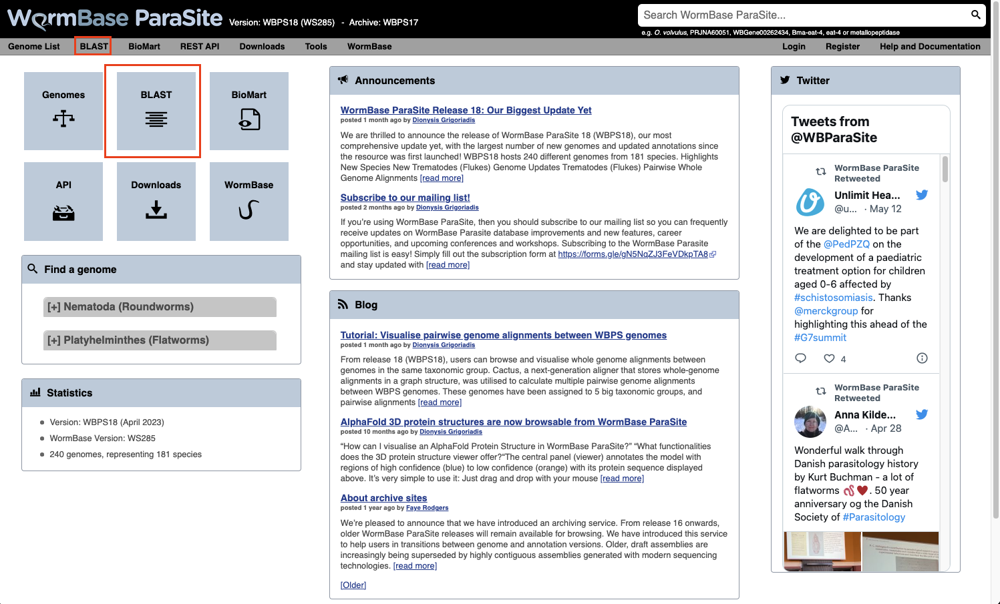
- You can also BLAST any existing sequence in WormBase ParaSite from the sequence page of a WBPS gene/transcript/protein using the "BLAST this sequence" button. 
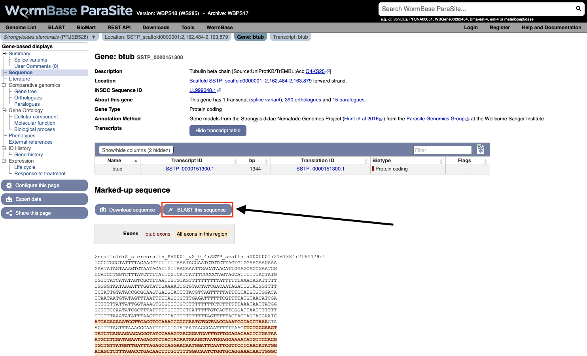

Both options will take you to WormBase ParaSite's BLAST tool page:
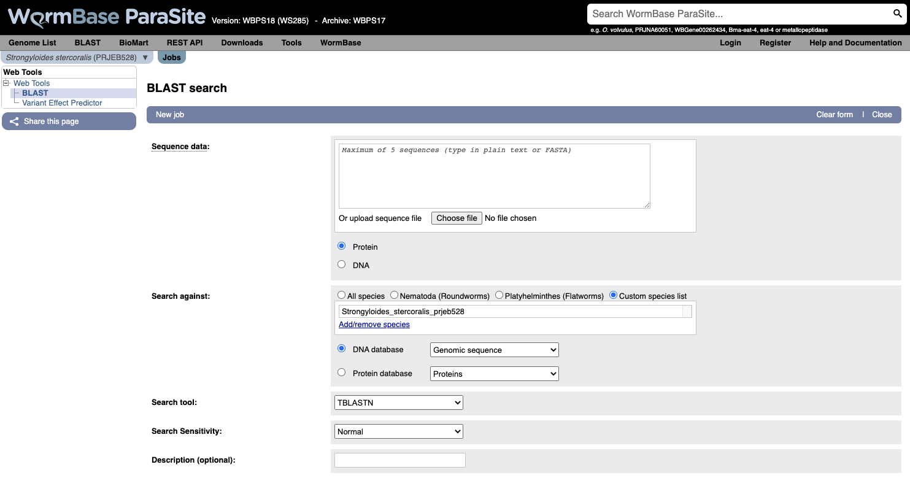

**How to evaluate Blast results?**
   
Metrics used in the results table:
- **Score**: The bit score gives an indication of how good the alignment is; the higher the score, the better
the alignment.
- **E-value**: The E-value gives an indication of the statistical significance of each alignment. A sequence alignment that has an E-value of 0.05 means that this
similarity has a 5 in 100 (1 in 20) chance of occurring by chance alone.
- **%ID or percent identity**: Percent identity is telling you how many residues in your query are an identical match to the hit. Closely related sequences will have a much higher % identity.

[↥ **Back to top**](#top)

---
### BLAST exercise <a name="blast_exercise"></a>

```
TTTGCAGATGCTTCTCCCTTCAAACTTGACGACGTCAACATTAATGACGTCATCATCAGA
ATCGTACGACGCTGATAATCCGGGGCTTCCGCCTGAGCCAATCCTGTCGGATTACGTGGA
AATGTTCACTTTGGTGCTCAATTTTATTGTTGGCGCGCCGTTGAACCTGGCCGCTTATAC
ACAGCTAAGCGAACGACCTACATCAACGCGGTTAGACCTTCTGAAGCGATCACTCAACTA
TTCGGATCTTCTCGTTCTATTCATCTACGTACCATCTCGTGCCTGCTGGTTATTGACCTA
CGATTGGCGGGGTGGAGATGCACTCTGTAAAATTGTCAAGATGTTTCATACGTTCGCGTT
TCAGAGCTCCTCCAACGTGATCGTGTGCATCGCCGTGGATCGCCTGCTATCCGTCCTCTC
CCCATCCCATCACAGCCCCAACAAAGCCCTGAAACGGACTAAAATGATGTTAATAGTCGC
GTGGATAGTAGCGCTAGTAATCTCATGCCCACAACTTTTCATCTGGAAAGCATATCTAGC
ACTTCCCGAGTATAATTGGAGCCAGTGTCTGCAAATTTGGGAGATTGCACGGATGGAAAA
ATTCAACAAACCACAGGTAGTGCCAGAGTTTGACGCCGAGTTCTGGTACAGCATACTGCA
TATTAGTCTCGTTTTTTGGATCCCTTGTATCATTATCATGCTATCCTACATCATAGTCAT
CTCATGGGTATGGATCAACTCTCGGCCGTCCATCCGTCACACCTCTTCATTTTCCTTCCA
CACCGGCTGCGATACGGTAGATACAGTACTGACTAGAGCCTCTGAATGGAATCCTTTGAA
GACATTCTCCCGTCACGTCAACATCAAGGAGCCCGAGAAGCCGATGACGACTCCCAGAAT
CGTGGTCAGCGACGAGACGGAGGTCCCACTGACGCAGCGACCATCGATTTCTCCGTCGGA
AGCGTCGGCGGTGATGAGGACCGGTGTGCACACGAGTACCTCGTATAATGCTAATTTGAA
TCGATCCCGAGCCCTGCGAGTTTCCTTGCTACTAGTCGTCGCGTACATCATCTGCTGGCT
ACCATATAACCTCATAAGTCTTATCCAATTTCTTGATCGGGACTTTTTTTCGTCATATCT
TAAACATGTCCACTTCTGCCAACAACTAATCATTTTTAACTCGGTCGTCAATCCATGGCT
CTACGGTTTCTTCGGTCCCCGCCGCCCGTCTACCACCGGTGCCGGCCGTCACTGATCTCC
AAACATCAAACATCGAATTCGCCATATCTTTCCAAAATCCCCCCAACGTTCCAGTTTTCA
AGCCCAACGAATTGCCAATGCCATATCTTTAACAACTTTTATGGTTTCTTGTTTGTTTTT
TTTTATTTATTTTATTGTAATGTTTGATTCTCGGTGAAAAATTTGTGTAAAATAAATTAT
TTTTTATGTGAAA
```
- Use WormBase ParaSite BLAST to find out the identity of this sequence, and which species it belongs to.
- Does it have any close hits in other genomes?
- BONUS question: Try BLASTing against both cDNA and a genomic DNA databases. What kind of sequence is this?

[↥ **Back to top**](#top)

---
### The genome browser <a name="genome_browser"></a>

A genome browser is a tool that allows you to visualise a genome assembly and its features, together with experimental data aligned to the genome.

There are several commonly used genome browsers in bioinformatics, each with different features. In WormBase ParaSite we have two:

* Ensembl - this can be used to browse a large catalog of genomes across the tree of life. WormBase ParaSite has an instance of the Ensembl browser built in, and [we explored it in Module 1](https://github.com/WCSCourses/HelminthBioinformatics_2023/blob/main/manuals/module_1_WBP1/module_1_WBP1.md#genome_browser). 

* [JBrowse 1](https://jbrowse.org/jbrowse1.html) - this is the genome browser that we’ll be using today. WormBase ParaSite has an instance of JBrowse for every genome that it hosts. The Apollo project is a well known extension of JBrowse, which, like Artemis, can be used to edit gene models.

There are many other genome browsers for different needs out there. Feel free to explore them at your own time:n[Integrative Genomics Viewer (IGV)](https://igv.org/),[UCSC Genome Browser](https://genome.ucsc.edu/),[Artemis/Artemis Comparison Tool (ACT)](https://www.sanger.ac.uk/tool/artemis-comparison-tool-act/) and the new version of Jbrowse: [Jbrowse 2](https://jbrowse.org/jb2/) 

#### Using JBrowse: basic functionality

In this example we’ll introduce the basic functionality of WormBase ParaSite's JBrowse 1, and demonstrate how to use the various tracks.

1. Navigate to the _S. mansoni_ genome page and select the “Genome Browser (JBrowse)” icon.


- Each scaffold is represented from its 5-prime end to its 3-prime end (relative to the forward strand).
- You can navigate to different scaffolds using the drop down menu in the middle of the screen, or by typing coordinates into the text box.
- Different types of data aligned to the genome are represented as tracks. When you first open JBrowse, one track will be on by default: the reference gene set.

For this example, we’ll consider that you’re interested in the gene Smp_312440.

2. Start by typing the identifier into the search box and clicking “Go” to navigate to the gene. 
3. Zoom in by clicking the large magnifying glass with a “+” symbol until the reference sequence resolves.

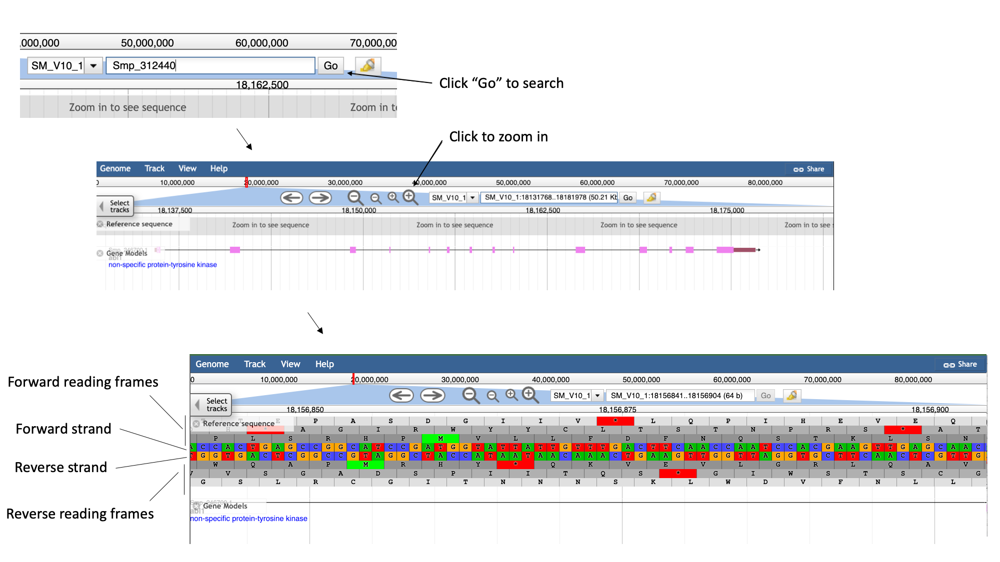

Here, you can see the forward and reverse DNA strands, together with the six possible translational reading frames (3 forward and 3 reverse).

4. Zoom out again so that you have the whole gene model in your field of view.
5. To extract sequence information about the gene, click the gene model such that a dialogue box pops up.

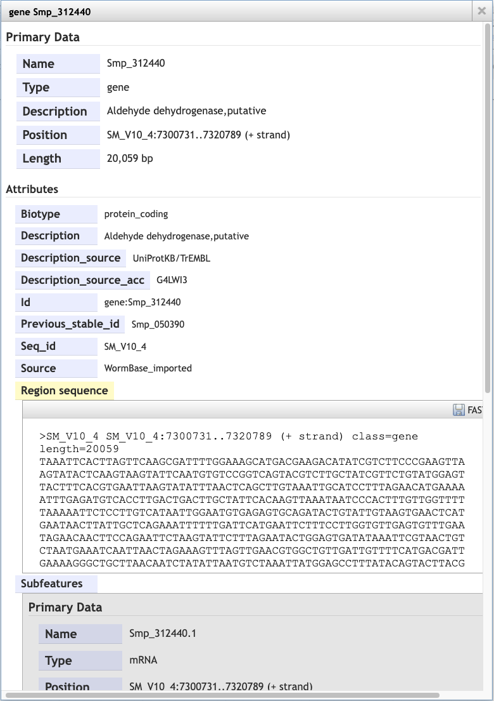

Scrolling down the content of the box, you can extract genomic or cDNA sequence, or the sequence of specific subfeatures (specific exons or UTRs, for example).

Alternatively, you may wish to extract the genomic sequence of a whole region:

6. Click the arrow next to the “Reference sequence” track label in the top left of the screen, select “Save track data”, then download the sequence as a FASTA
file.

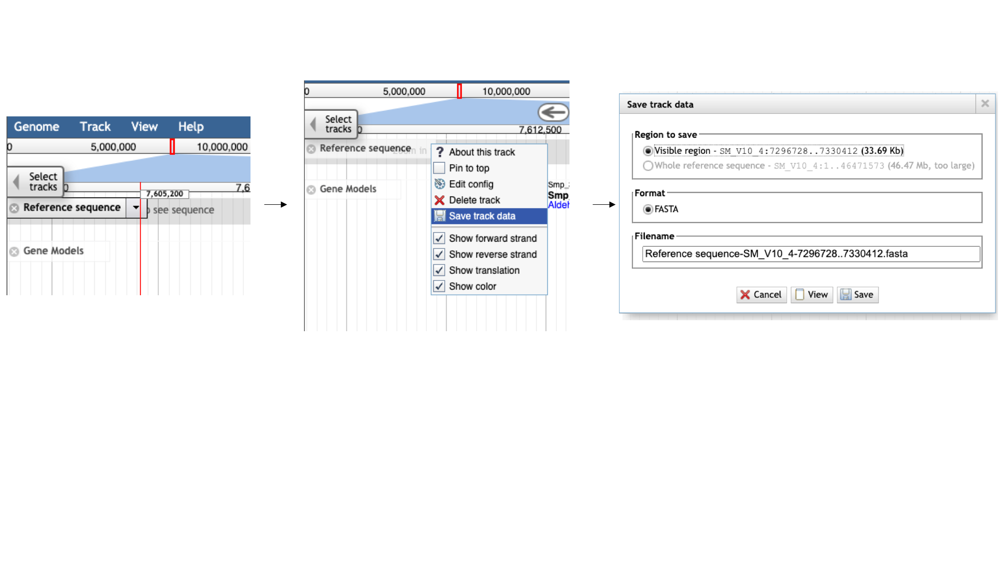

#### Tracks

We can also use JBrowse to view other types of data aligned to the genome. 

7. Click the “select tracks” button in the top left of the screen.


For most species, in addition to the gene model (“Genome Annotation”) track, there are two additional main types of track:

- Repeat regions tracks - repetitive regions of the genome are annotated as part of WormBase ParaSite’s production process. 
- RNASeq tracks - WormBase ParaSite has a process of finding and aligning RNASeq data in the sequencing archives for our species of interest. These can be useful, for example, for checking that a gene model is well supported by expression data, or seeing in which life stages, or under which conditions, a gene of interest is transcribed. 
  - For species with a lot of publicly available RNA-Seq data, such as _S. mansoni_, the easiest way to explore the samples that are available is by using the facets on the left hand side. The samples are organised by their metadata.

Let’s say you want to see in which life stages Smp_312440 is expressed:

8. Click the “developmental stage” facet 
9. Select a few of the available libraries (in the example below we've selected 3h schistosomules and miracidia) and click “back to browser”.

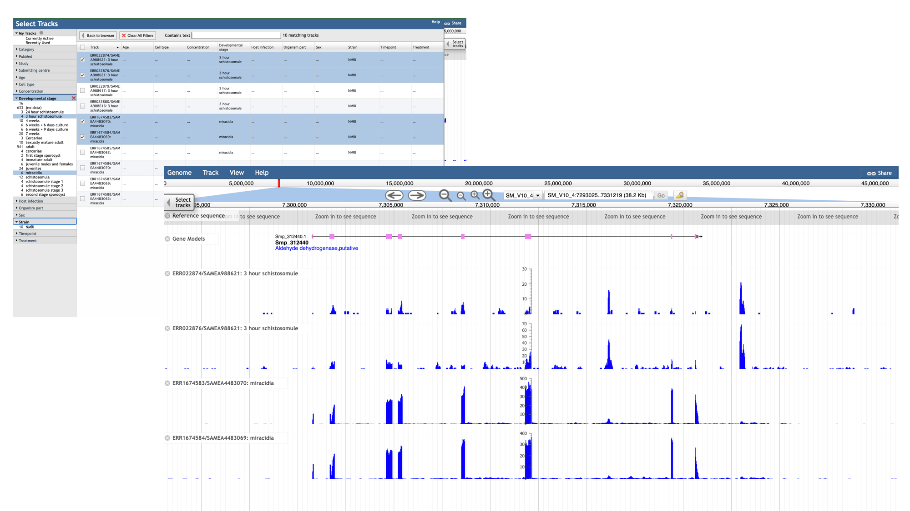

- Each track represents a different sequencing library, and shows the number of reads that have been aligned at each position. 
- By mousing over the histogram, you can see the exact number of aligned reads at each base. 
- We can see that a lot of the tracks show biological replicates of the same condition.- We can use combination tracks to combine replicate tracks “on the fly”, so we use up less space on the screen.

#### Visualising your own data

As well as looking at publicly available data, you can use WormBase ParaSite JBrowse to visualise your own data.

We’ll demonstrate how to do this using a BAM file that we have provided for you.

**BAM file?**
A BAM file is a type of file format used in genomics to store DNA sequencing data in a compressed and indexed manner.

In the module 3 data directory you should find a file named SRR3223448.bam. 

As a BAM file, this file is binary, so trying to read it as it is won’t be very informative. To read it we should first convert it into the SAM file format (non-binary, human-readable). We can do that with samtools:

- [Samtools](http://www.htslib.org/doc/samtools.html) is a useful software package for manipulating SAM and BAM files.
- We will use a samtools command to convert the BAM file to a SAM file so we can have a look at how it’s structured. Move to the module 3 data directory and type the following into your terminal:

```bash
samtools view -h SRR3223448.bam | less
```

<details closed>
<summary> <- Click here to read more about the BAM and SAM file formats at your own time.</summary>
The SAM file starts with a header section. All header lines begin with a ‘@’ character.


Move down through the file (by pressing the space bar) until you come to the alignment section. Here, each line represents a sequencing read (though be aware that the lines are long, so a single line will probably wrap around your terminal window a few times). Some of the key fields are labelled below:


The full SAM specification is available here: http://samtools.github.io/hts-specs/

Before we can visualise the file in JBrowse, we need to create an index. An index is another file that often accompanies a BAM file, and acts like a table of contents. Software such as JBrowse can look inside the index file and find where exactly in the corresponding BAM file it needs to look, without having to go through all of the reads (which would be computationally very expensive).

BAM index files should have exactly the same name as their corresponding BAM file, with the addition of a .bai suffix. We can index our BAM file using samtools. Type:

```bash
samtools index SRR3223448.bam
```

You should now see a file called SRR3223448.bam.bai in your working directory. We can now load the file into WormBase ParaSite JBrowse.


</details>
<br>

We can only add an indexed BAM file to Jbrowse (BAM file accompanied by a file with the same name with the addition of a .bai suffix). The BAM file in the directory is already indexed (You should see a file called SRR3223448.bam.bai in your working directory.)

11. To add the BAM track to our Jbrowse instance:
    - select the “Track” menu option in the top left of the screen.
    - Selecting “Open track file or URL” will open a dialogue box giving you an option to view a file that is either on your file system, or accessible via a URL.
    - Select both the BAM file and the index file. JBrowse guesses the file type from the name, but we have an option to correct it if it gets it wrong. We can see that it’s right this time.
    - Click “Open”.

Now we can see the reads aligned to the genome. Notice that this RNA-Seq data is stranded- this means that the library preparation protocol preserved information on which end of the RNA molecule was 5-prime and which end was 3-prime, so we can infer which strand of DNA it was transcribed from. This information is encoded in the BAM file, and JBrowse colours the reads accordingly:
- reads aligning to the forward strand are $\textcolor{pink}{\textsf{pink}}$
- and reads aligning to the reverse strand are $\textcolor{purple}{\textsf{purple}}$

[↥ **Back to top**](#top)

---
### VEP <a name="vep"></a>

Another WormBase ParaSite tool that we will look at today is the Variant Effect Predictor, or VEP.

A common approach to understanding the genetic basis of phenotypic differences is to identify genetic variants that are overrepresented in some populations of individuals.

For example, you might sequence two populations of worm: one that is susceptible to a drug and one that is resistant to the drug. You could then identify genomic positions where each of these populations differs from the reference genome.

VEP is a tool that allows you to predict what the consequences of these variants are: whether they fall within or near genes, and whether they result in a change to the amino acid sequence of a protein.

The standard file format for storing variation data is the [Variant Call Format (VCF)](https://samtools.github.io/hts-specs/VCFv4.2.pdf); this is another tab-delimited text format. Later in the course, you’ll see how to make one of these files. In the meantime, for some helminth genomes, these files have already been shared by other researchers. Today you’ll be using an available VCF file for _Strongyloides ratti_. 

First, we'll download a VCF file from the European Variation Archive (EVA).   Then will upload it to WormBase ParaSite

1. Go to the [European Variation Archive (EVA)](https://www.ebi.ac.uk/eva/).
2. Select the "Variant Browser" tab.

You can download complete studies from the "Study Browser" tab but today we are using the "Variant Browser" to download a much smaller file corresponding to a 250 kb region of the genome.

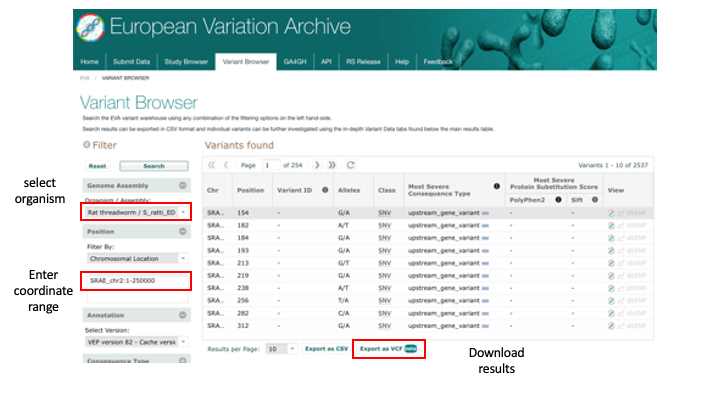

3. Download the first 250kb of S. ratti chromosome 2 and place it inside the "Module_3_WormBaseParaSite_2" directory:
  - Select "Rat threadworm / S_ratti_ED321" from the Organism/Assembly drop-down menu.
  - Filter by: Chromosomal Location - Region: SRAE_chr2:1-250000 and then click "Search".
  - Click "Export as VCF" and place the downloaded file inside the "Module_3_WormBaseParaSite_2" directory.

4. Move to the "Module_3_WormBaseParaSite_2" directory and have a look at the file to see how it is structured:

```bash
# look at the contents
less sratti*.vcf
```

You'll have to scroll down beyond the headers (lines starting with ##) to see the data lines. The actual data lines looks like:

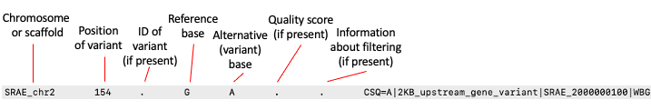

5. From the WormBase ParaSite homepage, select “Tools” from the toolbar.
6. From the “Tools” page, select Variant Effect Predictor
7. To submit a VEP job, just select the correct species (_Strongyloides ratti_), upload the VCF file we just downloaded and click “Run”.


8. Once you have clicked "Run", your input will be checked and submitted to the VEP as a job. All jobs associated with your session or account are shown in the "Recent Tickets" table. You may submit multiple jobs simultaneously.

9. Navigate to the results page:

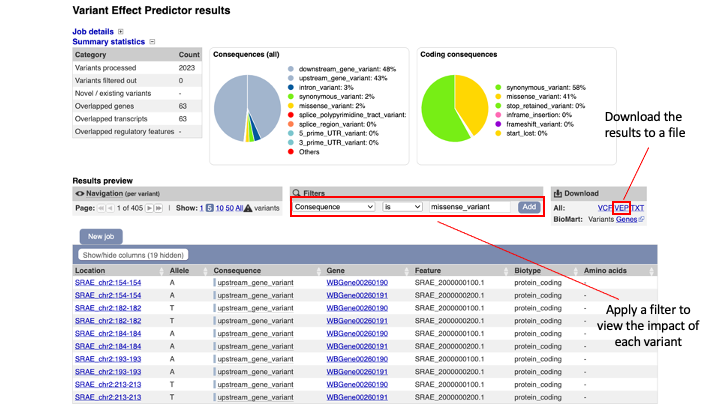

The results are presented in pie-charts and an interactive table:
- Pie Charts: The pie charts give a summary of the consequences of the variants found in the file. Variants with coding consequences are found in the protein-coding sequence of genes, whilst variants with non-coding consequences are in intergenic regions or non-coding regions of genes. These variants could still be functionally important; for example, variants in non-coding regions near genes can have effects on expression dynamics.
- Results Table: The results table shows one row per transcript and variant. By default all of the columns are shown; to temporarily hide columns, click the blue "Show/hide columns" button and select or deselect the columns you wish to view. The columns you select will be recalled when viewing other jobs.

10. You can explore the results interactively on the webpage using the Results Preview filter panel at the centre. Use this panel and filter for variant that cause (select "consequence") changes to amino acids (select "missense_variant").  

You can actually visualise the affected Amino acid by the "missense_variant" on the protein's 3D AlphaFold model ([We talked about these in our previous WBP module](https://github.com/WCSCourses/HelminthBioinformatics_2023/blob/main/manuals/module_1_WBP1/module_1_WBP1.md#af)).

To do this:

11. Go to the "Protein matches" column of the results table. If the "Protein matches" column has not been switched on you can do so by using the "Show/hide columns" button at the top left of the table". If the protein affected by the "missense_variant" has an AlphaFold protein model available, then you should see an "AlphaFold model" button in the "Protein matches" column. Click it.

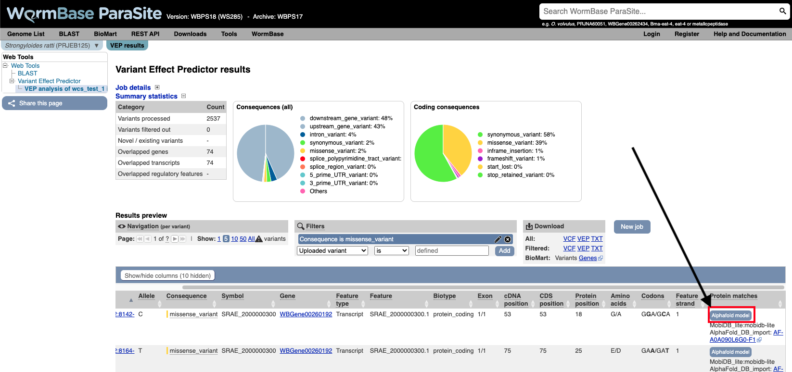

12. Explore the 3D protein model. You can  Click the "Focus" button underneath the variant information to zoom-in to the affected residue.

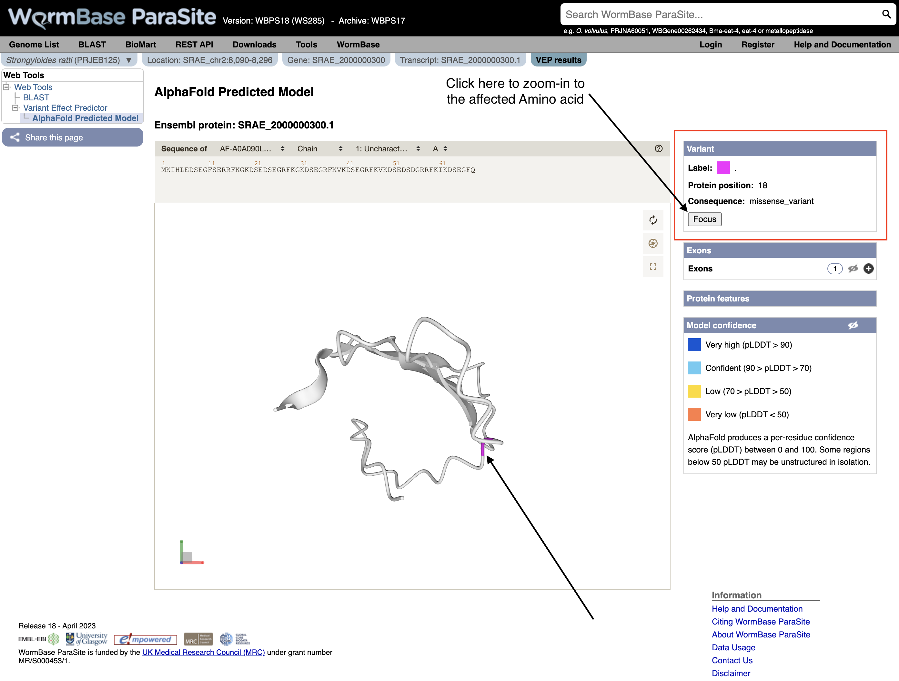

[↥ **Back to top**](#top)

#### VEP exercise <a name="vep_exercise"></a>

Download the VEP results from the example above as a “VEP file”. Use this file and the original VCF file to answer the following questions:

1. How many variants were there in the original dataset?

2. What are the different types of consequence that are found in the file, and how often does each occur?

3. List all of the variants found in SRAE_2000005500.1.  Which variant or variants show the greatest impact?

4. Create a list of genes where a missense variant is found.  

5. Find out which genes has the highest number of missense mutations.  View the distribution of variants along the coding sequence in Jbrowse.

Hint: to view the VCF in JBrowse you first need to compress and index it. Do:

```bash
bgzip file.vcf && tabix -p vcf file.vcf.gz
```

[↥ **Back to top**](#top)

## Accessing WormBase ParaSite data programmatically <a name="programmatic_access"></a>

So far we've seen how you can interact with WormBase ParaSite data via a web browser, and how to query data in bulk using BioMart.

In section we'll look at ways that you can interact with the same data but from the command line- first by downloading and processing files, and second via our REST API.

We'll use some of the tools that you were introduced to in module 2 to do this.
<br>
<br>
### Working with sequence and annotation files <a name="files"></a>

For some analysis tasks you will need to download large data files. For example, if running software to align sequencing reads to the genome you'll need a genome FASTA file (we met this format earlier). If you want to see which genes your reads overlap, we'll need a [GFF](https://github.com/The-Sequence-Ontology/Specifications/blob/master/gff3.md) or [GTF](https://mblab.wustl.edu/GTF22.html) file. Sometimes, extracting data from a file is just the quickest way to get the information you need. Such files are accessible on WormBase ParaSite in two ways:

1. On each genome landing page, in the Downloads section
2. Via our structured FTP site, which you can access here: http://ftp.ebi.ac.uk/pub/databases/wormbase/parasite/releases/current/species/

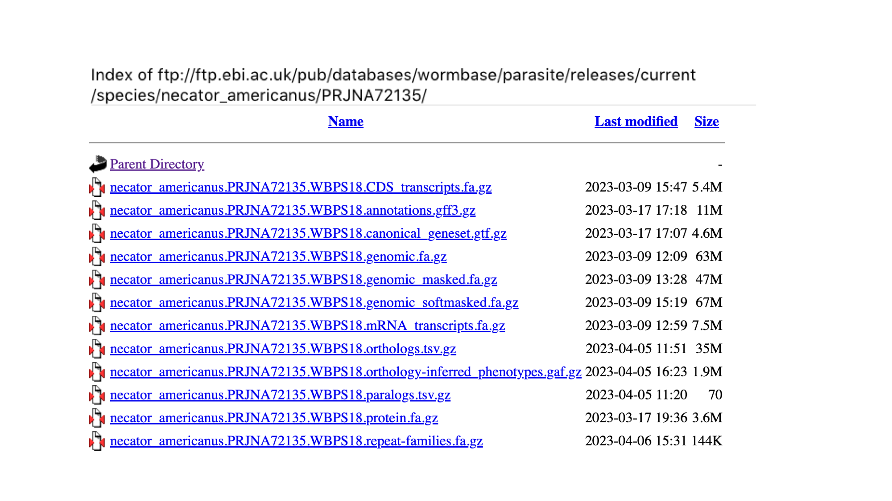

Note first of all that all of the files are compressed (gzipped) to save space. You can tell by the ".gz" file extension. 

The files come in three flavours:

- **FASTA files**<br>FASTA files have a ".fa" extension. We met this format in module 1. They are sequence files, with a header line (denoted by ">") followed by a nucleotide or amino acid sequence on the next line. We provide three types of annotation FASTA file - proteins, CDS sequences and full length mRNA sequences. We also provide genome FASTA files: these may be soft-masked, hard-masked or not masked at all. Masking is the process of marking up repetitive or low complexity sequences in the genome: "hard-masking" means replacing these bases with Ns, whereas "soft-masking" means making them lower-case. Many bioinformatics software packages are designed to work with soft-masked genomes.

- **Annotation files**<br>Annotation files have information about genomic features, such as genes. They come in two common formats, GFF (general feature format) and GTF (general transfer format), with the extenions ".gff3" and ".gtf" respectively. The full specification is available elsewhere (http://gmod.org/wiki/GFF3), but in short: each line describes a single feature, and related features can be linked together in a parent/child hierarchy. For example, an exon feature's parent might be an mRNA feature, and that mRNA's parent will be a gene feature:
  ```
  KI657455        WormBase_imported       gene    25      387     .       -       .       ID=gene:NECAME_00001;Name=NECAME_00001;biotype=protein_coding
  KI657455        WormBase_imported       mRNA    25      387     .       -       .       ID=transcript:NECAME_00001;Parent=gene:NECAME_00001;Name=NECAME_00001
  KI657455        WormBase_imported       exon    362     387     .       -       .       ID=exon:NECAME_00001.1;Parent=transcript:NECAME_00001
  KI657455        WormBase_imported       exon    25      277     .       -       .       ID=exon:NECAME_00001.2;Parent=transcript:NECAME_00001
  KI657455        WormBase_imported       CDS     362     387     .       -       0       ID=cds:NECAME_00001;Parent=transcript:NECAME_00001
  KI657455        WormBase_imported       CDS     25      277     .       -       1       ID=cds:NECAME_00001;Parent=transcript:NECAME_00001
  ```

- **Ortholog/paralog files**<br>Finally, we provide a TSV (tab-separated variable) file for each genome containing calculated ortholog and paralog relationships for all genes in the genome.

#### Walk through examples

1. First of all, move to the module's specific directory:
```bash
cd ~/Module_3_WormBaseParaSite_2
```

```wget``` is a handy utility for retrieving online files including the ones from the FTP. The following will pull down the _Necator americanus_ GFF3 file into your working directory:

```bash
wget http://ftp.ebi.ac.uk/pub/databases/wormbase/parasite/releases/current/species/necator_americanus/PRJNA72135/necator_americanus.PRJNA72135.WBPS18.annotations.gff3.gz

```

Unzip the file and have a look at the contents:

```bash
gzip -d necator_americanus.PRJNA72135.WBPS18.annotations.gff3.gz
less necator_americanus.PRJNA72135.WBPS18.annotations.gff3
```

Using the commands that you learned yesterday, we can manipulate these files to extract all sorts of information. Break down the following commands to understand what each section is doing:

You can see that we'll be using the ```awk``` command a lot. The ```awk``` command is a powerful text processing tool commonly used in Unix and Linux environments. It allows you to manipulate and analyze structured data, such as text files or output from other commands, based on patterns and actions defined by you.

To extract the names all of the gene features on scaffold "KI657457":

```bash

# There are various ways to achieve this

# One is:
grep "^KI657457" necator_americanus.PRJNA72135.WBPS18.annotations.gff3 | grep "\tgene\t" | cut -f9 | grep -o "Name=[^;]\+" | sed -e 's/Name=//'

# Another more specific one is:
grep -v "#"  necator_americanus.PRJNA72135.WBPS18.annotations.gff3  | awk '$3~/gene/ && $1~/KI657457/ {print}'  | grep -o "Name=[^;]\+" | sed -e 's/Name=//' 
```

Count how many genes each scaffold is annotated with:

```bash
# One way to do it:
grep "\tgene\t" necator_americanus.PRJNA72135.WBPS18.annotations.gff3 | cut -f1 | sort | uniq -c

# Another way:
grep -v "#"  necator_americanus.PRJNA72135.WBPS18.annotations.gff3  | awk '$3~/gene/{print}'  | cut -f 1 | sort | uniq -c
```

Similarly, using the protein FASTA file:

```bash
# download the file
wget https://ftp.ebi.ac.uk/pub/databases/wormbase/parasite/releases/current/species/necator_americanus/PRJNA72135/necator_americanus.PRJNA72135.WBPS18.protein.fa.gz

# unzip 
gzip -d necator_americanus.PRJNA72135.WBPS18.protein.fa.gz

# count the number of proteins
grep -c "^>" necator_americanus.PRJNA72135.WBPS18.protein.fa

# extract the sequence of NECAME_00165
sed -n -e "/NAME_00165/,/^>/p" necator_americanus.PRJNA72135.WBPS18.protein.fa | sed -e '$d'
```

And a more complicated ```awk``` to extract scaffold lengths in a genome FASTA file:

```bash
# download the file
wget  https://ftp.ebi.ac.uk/pub/databases/wormbase/parasite/releases/current/species/necator_americanus/PRJNA72135/necator_americanus.PRJNA72135.WBPS18.genomic.fa.gz

# unzip 
gzip -d necator_americanus.PRJNA72135.WBPS18.genomic.fa.gz

# count the lengths
awk '/^>/ { 
  if (seqlen) {while 
    print seqlen
  }
  split($1, header, " ")
  print header[1]
  seqlen = 0
  next
}
{
  seqlen += length($0)
}
END {print seqlen}'  necator_americanus.PRJNA72135.WBPS18.genomic.fa
```
[↥ **Back to top**](#top)

### The REST API <a name="api"></a>

The other way to query WormBase ParaSite data is via the REST API (Application Programming Interface). An API is just another way to retrieve data from a server, but this time via scripts or commands. You make a request to the server, but rather than returning a webpage, it returns the data in a structured format. We offer data in JSON (JavaScript Object Notation) and XML (Extensible Markup Language), which are both commonly used formats for data exchange. They are structured, so good for writing programs to interpret and manipulate them, but also human readable.

There are a few situations where accessing WormBase ParaSite data via the API might be the better choice over BioMart or the website:

1. For queries that you’re likely to have to run multiple times (for example, with different datasets, or against different genomes)

2. For queries that plug into a larger pipeline, it might be convenient to retrieve the data in an easily computer-processable format

3. Some types of data are not available in BioMart (such as CEGMA and BUSCO scores), and can only be accessed via the website or the API

In an earlier exercise, you used the assembly statistics widget on the genome page to compare _Brugia sp._ genome assemblies. In this example, we’ll do the same for the _Meloidogyne sp._ assemblies, using the API.

1. From the WormBase ParaSite home page, select “REST API” from the toolbar.

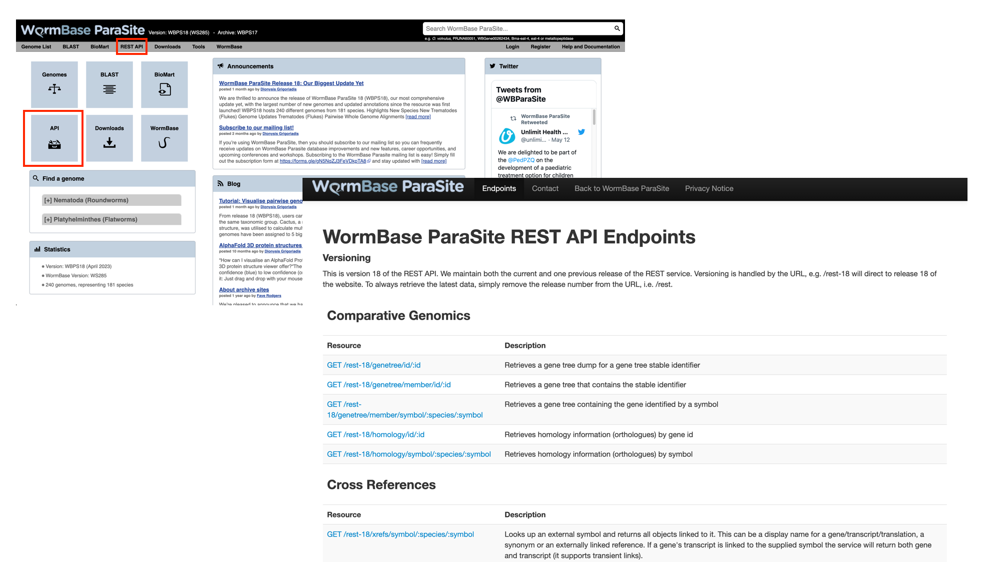

This page details the available REST endpoints: endpoints are URLs that accept API requests, and return data. Read the descriptions of the different resources to see the types of data that you can retrieve from the WormBase ParaSite API.

We want to retrieve the CEGMA and BUSCO scores of all of the _Meloidogyne sp._ assemblies in WormBase ParaSite. We’ll break the problem down into two steps: first, we’ll use the API to retrieve the names of all the _Meloidogyne sp._ assemblies that are available, then we’ll use those names to specify which assemblies we want to retrieve the CEGMA and BUSCO scores for.

2. Scroll down to the “Information” section and select the taxonomy endpoint

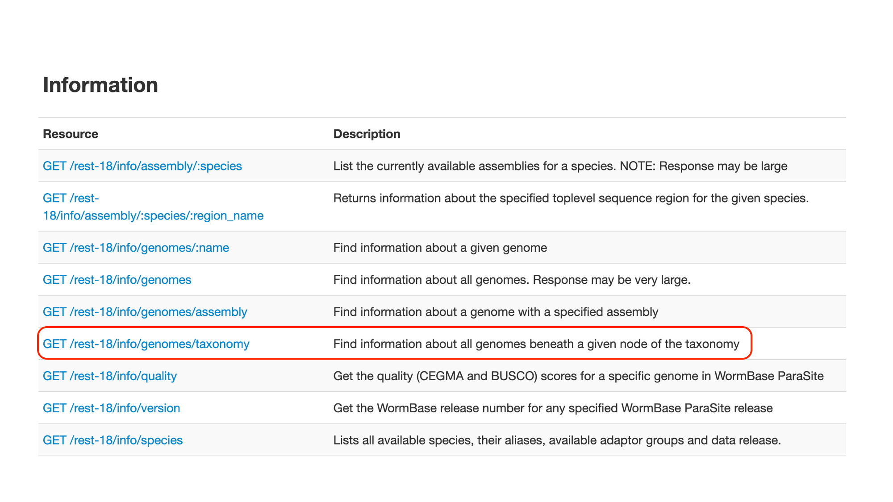

3. Scroll down to look at the example request

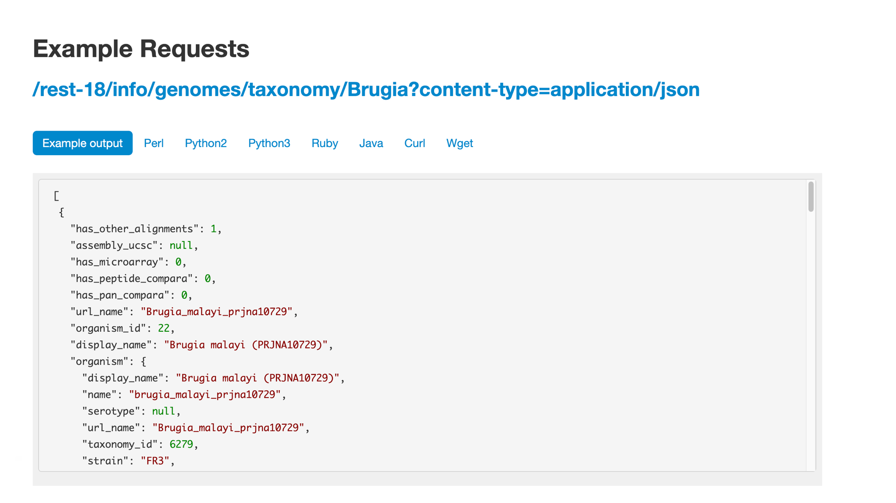

We offer examples on how to use these in several different programming languages - feel free to stick to the language you know best. Here, we’ll demonstrate how to use the command line tool curl. Open a terminal and copy or type the ```curl``` command below.

4. We’re interested in Meloidogyne sp., so replaced “Brugia” (in the WBPS example) with “Meloidogyne”.

```bash
curl -sL 'https://parasite.wormbase.org/rest/info/genomes/taxonomy/Meloidogyne?' -H 'Content-type:application/json'
```

Note: 
* we’ve also added the L (full name: --location) flag to the curl command, and changed “rest-18” to “rest” in the URL. “rest-18” refers to the 18th release of WormBase ParaSite; by removing the version number the request is automatically redirected to the most recent release.
The L flag tells curl to allow this redirection.
* The -s option is used silence or suppress the progress meter and error messages during the request.

You will see a lot of text! This is the data that we requested, in JSON format.

5. To format the response more nicely, pipe the output into another command line tool, ```jq```. ```jq``` allows us to manipulate JSON data on the command line (see the manual for more information on its usage: https://stedolan.github.io/jq/manual/).

```bash
curl -sL 'https://parasite.wormbase.org/rest/info/genomes/taxonomy/Meloidogyne?' -H 'Content-type:application/json'  | jq '.'
```

You should see the data now formatted like this:

```bash
[
  {
    "base_count": "258067405",
    "is_reference": "0",
    "division": "EnsemblParasite",
    "has_peptide_compara": "0",
    "assembly_accession": "GCA_900003985.1",
    "assembly_level": "scaffold",
    "genebuild": "2018-05-WormBase",
    "organism_id": "86",
    "serotype": null,
    "has_pan_compara": "0",
    "assembly_ucsc": null,
    "has_variations": "0",
    "name": "meloidogyne_arenaria_prjeb8714",
    "has_other_alignments": "1",
    "assembly_name": "ASM90000398v1",
    "has_synteny": "0",
    "display_name": "Meloidogyne arenaria (PRJEB8714)",
    "url_name": "Meloidogyne_arenaria_prjeb8714",
    "taxonomy_id": "6304",
    "scientific_name": "Meloidogyne arenaria",
    "assembly_id": "86",
    "strain": null,
    "assembly_default": "ASM90000398v1",
    "has_genome_alignments": "0",
    "species_taxonomy_id": "6304",
    "data_release_id": "1"
  },

```

JSON-formatted data consists of key-value pairs. A series of key-value pairs separated by commas and enclosed in curly brackets is a JSON object. Here, we have a JSON object for each _Meloidogyne sp._ assembly. The JSON objects are in a list (an array), which is enclosed by square brackets.

6. Extract the name of each genome using jq from the output above:
```bash
curl -sL 'https://parasite.wormbase.org/rest/info/genomes/taxonomy/Meloidogyne?' -H'Content-type:application/json' | jq -r '.[] | .name'
```
Here, '.[]' returns each element of the array (each assembly) one at a time, and '.name' extracts the value of the 'name' key for each of these elements.

You should see:

```bash
meloidogyne_arenaria_prjeb8714
meloidogyne_arenaria_prjna340324
meloidogyne_arenaria_prjna438575
meloidogyne_chitwoodi_race1prjna666745
meloidogyne_enterolobii_prjna340324
meloidogyne_floridensis_prjeb6016
meloidogyne_floridensis_prjna340324
meloidogyne_graminicola_prjna411966
meloidogyne_hapla_prjna29083
meloidogyne_incognita_prjeb8714
meloidogyne_incognita_prjna340324
meloidogyne_javanica_prjeb8714
meloidogyne_javanica_prjna340324
```

6. Put the list of species names in a file in your working directory:
     
```bash
curl -sL 'https://parasite.wormbase.org/rest/info/genomes/taxonomy/Meloidogyne?' -H 'Content-type:application/json'  | jq -r '.[] | .name' > species.txt
```

7. The next endpoint that we need is the quality endpoint. Find it on the WormBase ParaSite API endpoint page and have a look at the example.0

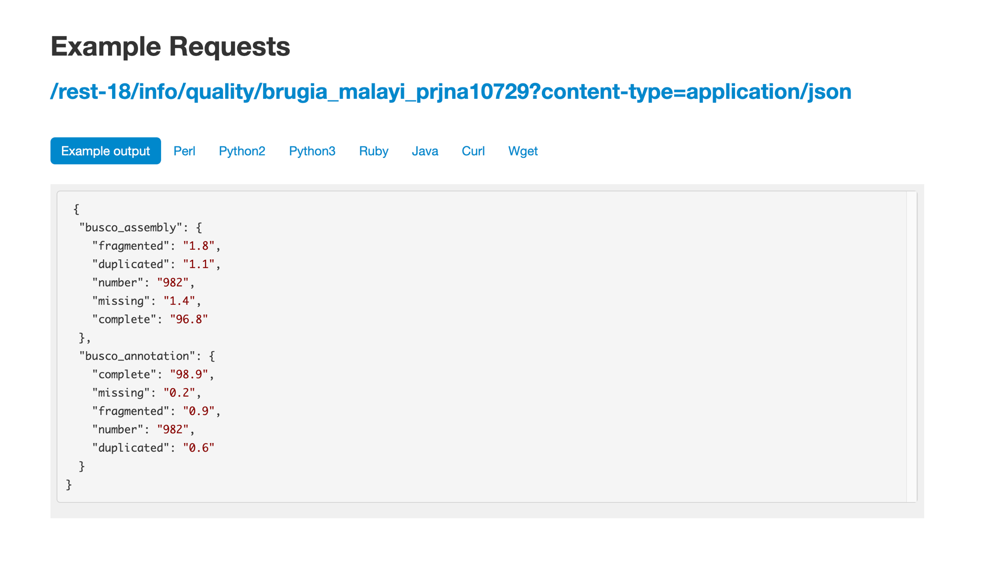

8. We will need to replace the species name in the URL, and make a separate request for each species. We can write a small loop in bash, reading from our species file, to achieve this:

```bash
while read species; do 
   curl -sL "https://parasite.wormbase.org/rest/info/quality/$species?" -H 'Content-type:application/json' 
done < species.txt
```

9. Again, we need to format the JSON nicely to make the output more readable:

```bash
while read species; do 
   curl -sL "https://parasite.wormbase.org/rest/info/quality/$species?" -H 'Content-type:application/json' | jq '.' 
done < species.txt
```

10. We’ll now produce a file with just the percentages of complete BUSCO assembly and BUSCO annotation genes for each species:

```bash
while read species; do 
   completeness_score=$(curl -sL "https://parasite.wormbase.org/rest/info/quality/$species?" -H 'Content-type:application/json' | jq -r '.busco_assembly.complete,
.busco_annotation.complete' )  
   echo $species $completeness_score >> assembly_completeness.txt
done < species.txt
```

11. Finally, sort that file by BUSCO annotation score:

```bash
sort -n -r -k3,3 assembly_completeness.txt

meloidogyne_arenaria_prjeb8714 65.1 76.5
meloidogyne_javanica_prjeb8714 61.1 75.5
meloidogyne_incognita_prjeb8714 61.8 75.4
meloidogyne_arenaria_prjna438575 57.9 74.4
meloidogyne_hapla_prjna29083 60.1 59.8
meloidogyne_graminicola_prjna411966 40.7 58.9
meloidogyne_javanica_prjna340324 57.7 57.8
meloidogyne_arenaria_prjna340324 55.7 54.9
meloidogyne_incognita_prjna340324 52.6 54.4
meloidogyne_enterolobii_prjna340324 49.7 54.1
meloidogyne_floridensis_prjna340324 49.9 46.5
meloidogyne_chitwoodi_race1prjna666745 57.8 45.9
meloidogyne_floridensis_prjeb6016 29.7 43.9
```
We can see that _M. arenaria_ is the assembly with the highest BUSCO Annotation score.

[↥ **Back to top**](#top)

---
#### API exercises <a name="api_exercises"></a> 

Adapt the commands that you used above to retrieve the following information from the WormBase ParaSite API. Note that you’ll need to use different endpoints: browse the site to see which ones to use.

1. List the _Meloidogyne sp._ assemblies by size, smallest to largest.
2. Retrieve the protein sequence of the guinea worm transcript DME_0000938001-mRNA-1.
3. Write a small program, `get_sequence_for_transcript.sh`, that takes any transcript ID as an argument and returns its protein sequence. For example, running

```bash
./get_sequence_for_transcript.sh DME_0000938001-mRNA-1
```    
should print:
```bash
MAKHNAVGIDLGTTYSC...
```
(Hint: shell scripts put arguments from the command line into special variables, named $1, $2 etc )

4. Retrieve a GFF file of all of the genes located on the AgB01 scaffold of the Ascaris suum PRJNA62057 assembly, between the following coordinates: 5284000 to 5836000.

5. Write a program, `retrieve_genes_in_region.sh` which takes species, scaffold, start and end coordinates as arguments and can return the above for any given region. For example, calling

```bash
./retrieve_genes_in_region.sh ascaris_suum_prjna62057 AgB01 5284000 5836000
```
should print the same result as question 4.

Feel free to expand or tweak your programs if you have time!

[↥ **Back to top**](#top)


---
## The WormBase ParaSite Expression browser <a name="expression_data"></a>

Earlier in this section, we looked at a gene in JBrowse and used RNAseq tracks to see in which life stages it was expressed. What if you were interested in transcriptional differences between life stages, but didn't have a specific gene in mind?

You might want to retrieve **all** of the _S. mansoni_ genes that are differentially expressed between 2 life cycle stages. 

WormBase ParaSite has collated RNAseq data from publicly available studies and analysed it against our genomes and annotations.

This means that if somebody has already conducted a study to compare the conditions that you're interested in, you can look up pre-calculated differentially expressed genes. 

1. Navigate back to the _S. mansoni_ genome landing page, and select "Gene expression"


2. We can see a summary of the different studies that have been conducted. We're interested in life cycle stages, so select the first study "Schistosoma mansoni transcriptomics at different life stages". 


For each study, we have a summary of the conditions for which data is available. You'll learn much more about how transcriptomic experiments are analysed in module 7, but for those who are interested we have used HISAT2 to align reads to the genome, HTSeq to quantify counts per gene and DESeq2 to compute differential expression per condition.

Several files are available for download. These are:

* **Characteristics and conditions per run** - a file summarising the metadata available for each sample/run in the study.
* **Counts of aligned reads per run (FeatureCounts)** - for each gene, raw counts per sample/run as produced by HTSeq (not normalised for library size).
* **Gene expression (TPM) per run** - for each gene, counts per sample/run normalised for gene length and library size (TPM = transcripts per million).
* **Gene expression (TPM) per condition as median across replicates** - As above, but a median value is calculated for each gene from all samples/runs of the same condition.
* **Differential expression** - The number of files here varies. For each experiment, we extract the different conditions for which pair-wise comparisons are possible. For this experiment, only one variable is changing between the samples (developmental stage), so we have 3 possible contrasts: 24h schistosomule v 3h schistosomule, 24h schistosomule v cercariae and 3h schistosomule v cercariae. The second study in the list ("Praziquantel mode of action and resistance") is more complicated; we have several facets changing between conditions (drug treatment, development stage, timepoint, strain **and** sex), resulting in many more possible contrasts. We calculate differential expression for any pairwise combination of conditions that have three or more replicates: it's down to you to choose which of those comparisons is biologically meaningful. There are 2 types of file available here:
    - Summary files: for each combination of variables for which comparisons have been calculated, this file contains the genes that show a significant difference in at least one comparison. 
    - Full results files: each of these files contain the full DESeq2 results for a contrast (i.e., fold changes for ALL genes, whether or not they are statistically significant).


3. Download the full results files for the "Schistosoma mansoni transcriptomics at different life stages" "24-hour-schistosomule-vs-cercariae" experiment by clicking "Full result files for 3 contrasts (zipped) and place it into the "Module_3_WormBaseParaSite_2" directory.

```bash
cd ~/Module_3_WormBaseParaSite_2

# Extract the compressed directory
unzip ERP000427.de.contrasts.zip

# move inside the results directory
cd ERP000427.de.contrasts

# have a look at the 24-hour-schistosomule-vs-cercariae file
grep -v "^#" 24-hour-schistosomule-vs-cercariae.tsv | less
```

Use some of the commands you learned yesterday to extract the following information from the "24-hour-schistosomule-vs-cercariae.tsv" file:

4. Extract the top 5 most significantly regulated genes (hint: the final column, "padj", gives the adjusted p value. A smaller adjusted p value = more significant).

```bash
grep -v "^#" 24-hour-schistosomule-vs-cercariae.tsv | grep -v "^gene_id" | sort -g -k 7,7 | awk -F'\t' '$7 != "NA"' | head -n 5
```

5. Of the genes with an adjusted p-value that is less than 0.05, which is (a) most highly upregulated in the 24h schistosomules v the cercariae (b) most strongly upregulated in the cercariae v the 24h schistosomules?
```bash
# upregulated in the 24h schistosomules means tha Log2FoldChange (column 3) should be a positive number
grep -v "^#" 24-hour-schistosomule-vs-cercariae.tsv | grep -v "^gene_id" | awk -F'\t' '$7 != "NA" && $7 < 0.05 && $3 > 0' | sort -r -g -k 3,3 | head -n 10


# upregulated in the cercariate means tha Log2FoldChange (column 3) should be a negative number
grep -v "^#" 24-hour-schistosomule-vs-cercariae.tsv | grep -v "^gene_id" | awk -F'\t' '$7 != "NA" && $7 < 0.05 && $3 < 0' | sort -g -k 3,3 | head -n 10
```

[↥ **Back to top**](#top)

---
## Performing Gene-set enrichment analysis <a name="gene-set"></a> 

Gene set enrichment analysis (GSEA) (also called functional enrichment analysis or pathway enrichment analysis) is a method to identify classes of genes or proteins that are over-represented in a large set of genes or proteins, and may have an association with disease phenotypes.


In the previous module we talked about Gene Ontology (GO) [here](https://github.com/WCSCourses/HelminthBioinformatics_2023/blob/wbps_edits/manuals/module_1_WBP1/module_1_WBP1.md#go_terms).

"Gene Ontology" enrichment analysis is one of the most commonly used enrichment analyses.

Gene ontology is a formal representation of knowledge about a gene with respect to three aspects:
Molecular Function, Cellular Component and Biological Process.

So what is the Gene Ontology (GO) enrichment analysis?

Fundamentally, the gene ontology analysis is meant to answer a very simple question: “What biological processes, molecular functions, and cellular components are significantly associated with a set of genes or proteins?”

For example, we can take the list of genes we identified as significantly upregulated in cercariae vs 24h-schistosomules and try to identify what are the biological processes, cellular components and molecular functions that are implicated in this developmental stage comparison.

Instead of manually trying to identify which genes in your list of differentially expressed genes have similar biological processes, cellular component and molecular functions, the GO enrichment analysis does it for you. More specifically, it clusters the genes into gene ontologies group, performs statistical analysis and shows you the most significantly overepressented ontologies!

So basically a GO enrichment analysis takes a list of gene identifiers like this:

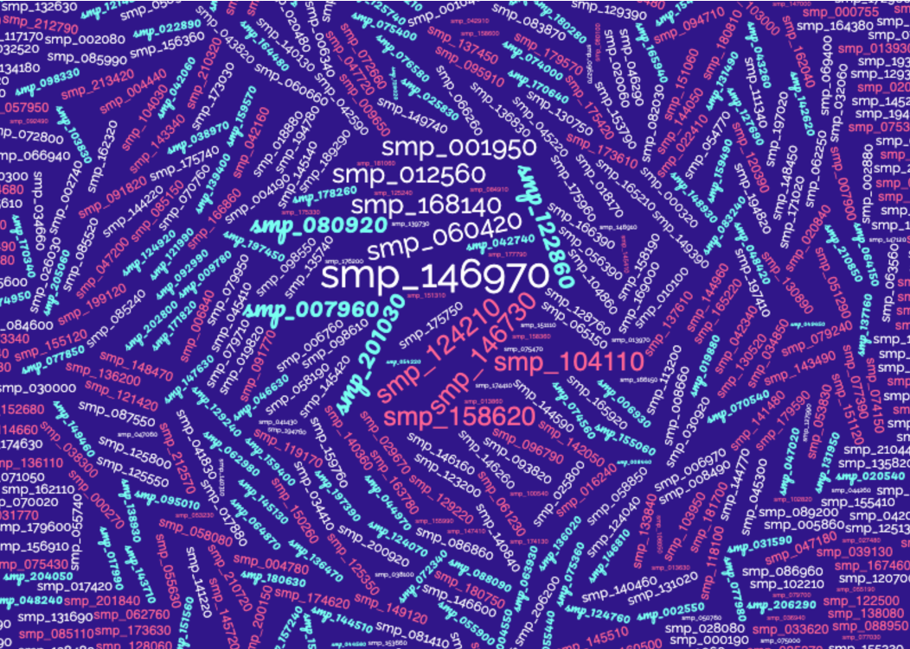

and organises them to Gene Ontology terms (GO):

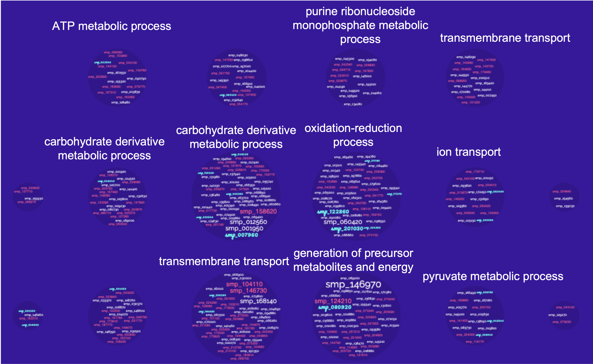
<br><br>
WormBase ParaSite offers a tool that performs this kind of analysis: g:Profiler that can be accessed from the "Tools" page:

- Go to WormBase ParaSite (https://parasite.wormbase.org/). Click "Tools" at the top menu. Click "g:Profiler" in the tools table.


[↥ **Back to top**](#top)

---
### Gene-set enrichment analysis exercise <a name="gene-set_exercises"></a> 

Use the 24-hour-schistosomule-vs-cercariae.tsv from the previous section and print a list of genes with an adjusted p-value that is less than 0.05, which are most strongly upregulated in the cercariae v the 24h schistosomules.

1. Use gProfiler and perform a Gene-set enrichment analysis for these 40 genes from the "Schistosoma mansoni (PRJEA36577)" organism.

2. Which are the 3 most significantly enriched Cellular Component terms? Are they relevant to this developmental stage comparion we're performing?

3. Expand the stats by using the ">>" in the header of the GO:CC result table. Try to interpret the T, Q, TnQ and U metrics. What do they represent?
    <details closed>
    <summary>Help!</summary>
    You can read more here: https://biit.cs.ut.ee/gprofiler/page/docs<br>
   * T - Term Size: How many S. mansoni genes are in general associated with this term.<br>
   * Q - Query Size: The number of genes in our gene list (the one we run the analysis for). In our case this number should theoretically be 40, however it is 14, why?<br>
   * TnQ - Overlap Size: How many genes from our list are associated with this term.<br>
   * U - Total number of S. mansoni genes.<br>
    </details>

[↥ **Back to top**](#top)
