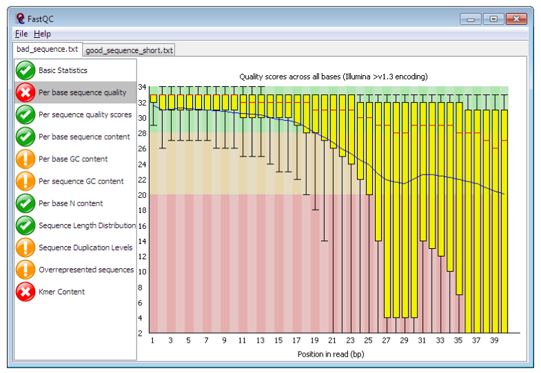

# Genetic Variation

Steve Doyle, 2023

## Table of Contents
1. [Overview and Aims](#intro)
2. [Quality control of raw sequencing data](#dataQC)
3. [Preparing your reference sequence prior to mapping](#ref)
4. [Short read mapping](#mapping)
5. [Calling SNPs in our mapped sample](#snps)
6. [Visualising mapped reads and variants using Artemis](#artemis)
7. [Mapping reads from multiple samples](#mapping_multi)
8. [Calling SNPs in multiple samples at the same time](#snps_multi)
9. [Visualing SNP data using WormBase ParaSite and Artemis](#snps_vis)
10. [Analysis of genetic variation using R](#r)
11. [Principal component analysis of genetic diversity](#pca)
12. [Exploring genetic data using phylogenetic trees](#trees)
13. [Integrating genetic and geographic data: maps](#maps)

<br>
<br>


## 1. Overview and Aims <a name="intro"></a>
Genetic variation can tell us a lot about an organisms evolutionary past, broad and fine-scale relationships within and between species, and the mechanisms by
which organisms adapt to new environments or selection pressures such as drug treatmennt. The use of genomics to understand genetic variation offers insight into 
these processes at a range of resolutions, from single nucleotide polymorphisms genome-wide to chromosomal rearrangements.   

Modern genomic approaches such as high-throughput sequencing has enabled not only the rapid increase in reference genome assemblies, but also the ability to resequence 
genomes from many individuals within a species. The re-sequencing of a genome typically aims to align or map new sequence data to a reference genome (please 
note that we will use the terms “aligning” and “mapping” interchangeably), and identify differences between the newly sequenced sample and the reference genome. These differences
can vary in number and size, ranging from single-base substitutions called *single nucleotide polymorphisms (SNPs)*, *INsertions and DELetions (INDELs)* that can range from one 
to many base pairs, to *copy number variants (CNVs)* of, for example, one or more genes. By comparing these different types of genetic variations between closely related 
populations or individual organisms, in is possible to learn how genetic differences that may cause phenotypic differences, such as drug resistance or increased virulence in pathogens, 
or changed susceptibility to disease in humans. 

One important prerequisite for the mapping of sequence data to work is that the reference and the re-sequenced subject have 
the same genome architecture, ie, the genome sequence can not be too dissimilar to the resequenced data, else, the reads will not map to the genome accurately.

In this exercise, you will be analyzing genetic variation in the gastrointestinal helminth *Haemonchus contortus*. *H. contortus* is an important 
pathogen of wild and domesticated ruminants worldwide, and has a major impact on the health and economic viability of sheep and goat farming in 
particular. It is also a genetically tractable model used for drug discovery, vaccine development, and anthelmintic resistance research. A chromosome-scale 
reference genome assembly and manually curated genome annotation are both available to download and explore at WormBase Parasite.
The sequencing data you will be using in this module is from two published studies - [Salle et al 2019 Nature Communications](https://doi.org/10.1038/s41467-019-12695-4) 
and [Doyle et al. 2020 Communications Biology](https://doi.org/10.1038/s42003-020-01377-3) - which describe the global and genome-wide genetic diversity of *H. contortus*, all of 
which was generated at the Wellcome Sanger Institute. Analysis of global diversity allows you to understand aspects of the species biology, such as how different populations are 
connected (which may be important to understand the spread of a pathogen or ongoing transmission), whether populations are growing or declining (perhaps in response to drug
treatment), or the impact of selection on regions or specific genes throughout the genome. 

Although whole-genome sequencing data was generated for these samples, we have extracted only the mitochondrial DNA-derived reads for you to work with. The main reason for this is 
that at this scale, the data should be able to be analysed efficiently on your computer without the need for high performance computing infrastructure and/or capacity. 

To analyse these data, we will be working in both the unix and R command line environments. This is because we typically manipulate high throughput sequencing data such 
as those you will be using in unix, i.e., read mapping and SNP calling, whereas the population genetic analyses are commonly written using R tools. 
Although some graphical user interface (GUI) tools such as CLC Genomics and Genious are available (at a cost) to do similar tasks, using the command 
line gives you much greater flexibility in the analyses that you can do and the scale that you can do it, and it is freely available. There will be 
a considerable amount of coding in this module - this may be daunting at first, however, with some practice, it will become much easier. 

We will also be using Artemis, a computer program designed to view and edit genomic sequences and visualise annotations in a highly interactive graphical 
format. In this exercise, we will use Artemis to visualise our genomic sequencing data mapped to our reference sequence, and identify the variants that 
differ between our samples and the reference.

The aims of this module are to familiarize you with tools and concepts that will allow you to:
- map high-throughput sequencing reads to a genome;
- bioinformatically identify and filter single nucleotide polymorphisms in your samples;  
- visualize sequencing reads and genetic variants in your samples;
- analyse patterns of genetic diversity in your data, and link these patterns to metadata to uncover biological insights in your species.


---

[↥ **Back to top**](#top)
<br>
<br>

Lets get started!

```bash 
# Lets move to the working directory
cd Module_6_Genetic_Variation

# It is always worth checking that you are in the correct directory with the data you want before attempting to do any work. Use the "list" command to do so:
ls -lrt 

```

   

You should be able to see:
- a directory called “raw_reads”, which contains all of the sequencing data we will be working with today, 
- a directory called "R_analysis", where we will performed our population genetic analyses, 
- two files, one is your reference sequence that we will map our raw reads to, and the other contains metadata about our samples that we will be using later. 

It is a good idea to collect all metadata to do with a study early, as it can help you explore your data in the analysis, and help interpret the genetic signals that you hopefully will discover.


---

[↥ **Back to top**](#top)
<br>
<br>


## 2. Quality control of raw sequencing data <a name="dataQC"></a>

The first exercise of any genomics project is to turn your sample of interest into sequencing data. There are many steps involved, including sample collection (and storage), DNA extraction (and storage), 
sequencing library preparation, and then finally submitting and having your DNA library sequenced on one or more of a number of different sequencing platforms. Not surprisingly then is that the 
success of each step will influence how well your sample will be sequenced and will impact on the quality of the data generated.  Exploring and understanding the characteristics of the raw data 
before any assembly is performed should give you some confidence in whether your data is sufficient to undertake a genomic analysis, and may provide some insight into how an analysis will proceed.

We will start by using a tool called **FastQC** (https://www.bioinformatics.babraham.ac.uk/projects/fastqc/) to examine some characteristics of your raw data. FastQC takes raw fastq reads and 
provides simple graphs and tables to quickly assess the quality of the data. It also highlights where they may be problems in different aspects of your data.




**Figure.** Example FastQC output. 	https://www.bioinformatics.babraham.ac.uk/projects/fastqc/


The main panel of this figure shows an example of the comparison of the distribution of per base quality (Phred score, on the y-axis) per base position in the read (x-axis). Phred scores above 30 
are typically considered to be good quality for an Illumina read. In this case, it shows higher quality bases toward the start of the read (in the green section), followed by a decrease in quality 
along the read, in which the quality drops into the yellow (Phred < 30) and then into the red (Phred < 20). Some examples of “good” and “bad” quality data is found in the “Example Reports” section of 
the FastQC website.


### 2.1. Running and interpreting FastQC
Lets run FastQC and explore our data.

```bash
# Go to the working directory:
cd raw_reads

# To start with, let's run fastqc on a single file so you can see how it works:
fastqc AUS_WAL_OA_001_1.fastq.gz

# Hopefully, it should have run pretty quickly, as the dataset is quite small. To show you that it is working, it should have shown a progress report on your terminal.

# We have lots of samples, and it will take a little while to run them all. Let's run a small number of samples and take a look at the results, using the following "for loop" command:
for i in AUS*.fastq.gz; do fastqc ${i}; done

# This "for loop" is going to run fastqc on all of the files starting with "AUS", ie, the Australian samples. Once FastQC has finished running, run MultiQC and visualise the output in the FireFox web browser:

multiqc --interactive .

firefox multiqc_report.html

```


FastQC generates output files than can be visualised independently. However, when you have multiple samples, it is slow and difficult to compare. [MultiQC](https://multiqc.info/) is a great tool for visualising multiple samples at 
the same time, which simplifies comparing different samples and can help you to see trends in your data. MultiQC can take many different sample types and analyses as input, not just FastQC. If you are working
with multi-sample sequencing data, it is work looking at whether there are other tools than can be summarised here. 

Looking at the "multiqc_report.html" report in FireFox, there are a number of windows to look at, including:

- General statistics
	- summarises various statistics per sample
- FastQC 
	- ***Sequence counts:***
		- shows relative proportion of unique and duplicated reads. Some duplicated reads are expected, however, it is a technical artefact and too many may be a problem.
	- ***Sequence Quality Histograms:***
		- Good overall indicator of data quality. Should remain mostly in the green, however, will drop in quality over the length of the read. Longer reads will show great drop, and R2 will show greater drop compared to R1.
	- ***Per Sequence Quality Scores:***
		- similar data to the "Sequence Quality Histograms"
	- ***Per Base Sequence Content:***
		- The proportion of each base position for which each of the four normal DNA bases has been called.
	- ***Per Sequence GC Content:***
		- The average GC content of reads. 
		- Abnormal GC distribution is a good indicator of contamination. Does the GC profile fit the expected GC content for your species of interest? Is it a smooth distribution, or are there spikes? 
	- ***Per Base N Content:***
		- The percentage of base calls at each position for which an N was called.
		- Is there an excess of positions in the reads for which a “N” base was called? Excess Ns can often indicate an issue with the sequencing.
	- ***Sequence Length Distribution:***
		- The distribution of fragment sizes (read lengths) found. Sequencing lengths "should" be the same if they were sequenced together. 
		- Might be more relevant if you have trimmed your data, and want to see the effect of processing.
	- ***Sequence Duplication Levels:***
		- The relative level of duplication found for every sequence.
		- Is there excessive duplication? Duplication may suggests artefacts generated during library preparation / PCR amplification
	- ***Overrepresented sequences:***
		- The total amount of overrepresented sequences found in each library.
		- could reflect biases based on certain sequences being present more than expected.
	- ***Adapter Content:***
		- The cumulative percentage count of the proportion of your library which has seen each of the adapter sequences at each position.
		- What is the proportion of known Illumina adapters that are present in the data?
	- ***Status Checks:***
		- Status for each FastQC section showing whether results seem entirely normal (green), slightly abnormal (orange) or very unusual (red).
		- NOTE: it is parameterised on human data, i.e., GC content, and so may report as “failing” based on assessing your data [if not human] because it does not look like human 
		- some "fails" are not a problem  

Hopefully, you should see that all of the Australian samples are fairly similar to each other, and the data for each sample looks quite good. This is an ideal scenario; however, it is not always like this. 
To save time, we have generated a multiQC report for all of the samples, which can be accessed by clicking on the link below.

[MultiQC report for all samples](figures/multiqc_all_samples.html)  


#### 2.2. Questions:
- How does the "all sample" report compared to the "Australian-only sample" report?
- From the "General statistics" section, can we see any sample groups that look different and that might be problematic for our analyses?
- Are all of the read lengths the same? How can you tell?
- Can you think of any other quality control checks on the raw data that you might want to do before analysing your data? Hint: think about where these worms are collected from. 


---

[↥ **Back to top**](#top)
<br>
<br>


## 3. Preparing your reference sequence prior to mapping <a name="ref"></a>
Before mapping out samples, we need a reference genome. If you didn't have a reference genome for your species, you might have to first assemble the reads to make a draft genome assembly. 
That is outside of the scope of this workshop, but please talk to the instructors about this if you are interested.

Fortunately, we have access to a high-quality reference genome for *Haemonchus contortus*, which we can download from [WormBase ParaSite](https://parasite.wormbase.org/Haemonchus_contortus_prjeb506/Info/Index/). 
From this reference genome, we need to extract the mitochondrial genome, which will be the focus of our analyses.

#### 3.1 Questions:
- Looking at the WormBase ParaSite website for *Haemonchus contortus* - how big is the genome? how many genes are present?
- There is a second *Haemonchus contortus* genome resource also present - how do the two genomes compare?


```bash
# Download the Haemonchus contortus reference genome from WormBase ParaSite, and unzip it:
wget https://ftp.ebi.ac.uk/pub/databases/wormbase/parasite/releases/WBPS18/species/haemonchus_contortus/PRJEB506/haemonchus_contortus.PRJEB506.WBPS18.genomic.fa.gz

gunzip haemonchus_contortus.PRJEB506.WBPS18.genomic.fa.gz

# The file you have downloaded is the whole genome assembly, and we only want the mitochondrial genome. We can create a new file containing the mitochondrial genome using:
samtools faidx haemonchus_contortus.PRJEB506.WBPS18.genomic.fa mitochondrion > hcontortus_mtDNA.fasta

```

The command *samtools faidx* is a really useful for a few different reasons:
- Its primary job is to create an "index" file which is necessary for some tools - the index file will have a ".fai" extension
- However, it can be used to extract one or more sequences from a multi-sequence file - this is exactly what we have done here, extracting the "mitochondria" sequence from the whole genome assembly
- It can also be used to extract part of a sequence, for example, modifying the above command can be used to extract a particular sequnece based on a sequence range, ie 1-100. 

```bash
# Extract the first 100 bases of the mitochondrial genome
samtools faidx haemonchus_contortus.PRJEB506.WBPS18.genomic.fa mitochondrion:1-100

```

- this could be useful to, for example, extract specific gene or feature coordinates. 
- to try this, attempt the following:
	- go to WormBase ParaSite, and search for the "cox1" gene (HCON_00667215) to identify the start and end coordinates in the mitochondrial genome
	- on the command line, using "samtools faidx" and the cox1 gene coordinates, extract the sequence and save it to a new file
	- once you have the cox1 sequence in the new file, have a look at the header of the sequence - does it look sensible? What would be a sensible naming stategy if you have 100 mtDNA genomes or genes or sequneces from different species extracted this way?
	- if not, change the header name using a "sed" command.  


---

[↥ **Back to top**](#top)
<br>
<br>


## 4. Short read mapping <a name="mapping"></a>
The next step is to align or map our raw sequencing data to the reference genome. 

There are multiple short-read alignment programs, each with their own strengths, weaknesses, and caveats. Wikipedia has a good list and description 
of each. In this example, we are going to use one of the most commonly used tools for sequence alignment, BWA.

From the manual available here http://bio-bwa.sourceforge.net/ : “BWA is a software package for mapping low-divergent sequences against a large 
reference genome, such as the human genome. It consists of three algorithms: BWA-backtrack, BWA-SW and BWA-MEM. The first algorithm is designed 
for Illumina sequence reads up to 100bp, while the rest two for longer sequences ranged from 70 bp to 1 Mbp. BWA-MEM and BWA-SW share similar features
such as long-read support and split alignment, but BWA-MEM, which is the latest, is generally recommended for high-quality queries as it is faster and 
more accurate. BWA-MEM also has better performance than BWA-backtrack for 70-100bp Illumina reads.”

Although BWA does not call Single Nucleotide Polymorphisms (SNPs) like some short-read alignment programs, e.g. MAQ, it is thought to be more 
accurate in what it does do and it outputs alignments in the SAM format which is supported by several generic SNP callers such as SAMtools and GATK.
BWA has a manual that has much more details on the commands we will use. This can be found here: http://bio-bwa.sourceforge.net/bwa.shtml or from 
the [original reference](https://doi.org/10.1093/bioinformatics/btp324).


### 4.1. Mapping reads from a single sample
To start with, we are going to work on a single sample to familiarise you with the necessary steps required to:
- get organised with directories (it is really important to keep organised!!!)
- map your reads
- convert your mapped reads file into a format that can be read by our visualisation tool, Artemis.


```bash
# make a new directory (mkdir) and move into it (cd):
mkdir single_sample_analysis

cd single_sample_analysis

# lets copy (cp) the reference into our working directory:
cp ../hcontortus_mtDNA.fasta .

# prepare your reference sequence by creating an index. An index is like an index in a book - it speeds up searching:
bwa index hcontortus_mtDNA.fasta

# map your reads to the reference using bwa mem. Note that we are referring back into the raw reads directory using the "../":
bwa mem hcontortus_mtDNA.fasta ../raw_reads/AUS_WAL_OA_001_1.fastq.gz ../raw_reads/AUS_WAL_OA_001_2.fastq.gz > single_sample.tmp.sam

# convert the sam file to a bam file. We will also filter the reads using the “q” parameter:
samtools view -q 15 -b -o single_sample.tmp.bam single_sample.tmp.sam

# sort the reads in the bam file: 
samtools sort single_sample.tmp.bam -o single_sample.tmp.sorted.bam

# finally, index the bam file:
samtools index single_sample.tmp.sorted.bam

# to make sense of what we are doing with the mapping, lets open the top of our SAM file and have a look at what the data means:
head single_sample.tmp.sam

```

  
**Figure** Exploring the SAM file format


Most of the data in a SAM file is relatively easy to interpret - it contains information about each read, where 
it is mapped in the genome, and how well it maps to the genome. 

One column that is not easy to interpret is the "flag" column. It contains various numbers, which are the sum of "bits" that actually decribe many different
aspects of how the read is mapped, in a very simple, numerical format. 

Sometimes, understanding these numbers can be useful. We can use the following website to help us interpret these numbers. Click on the link, and input 
the numbers from the above figure and see what they mean for each read. 

[Picard: Decoding SAM flags](https://broadinstitute.github.io/picard/explain-flags.html)

Try putting in a random number and see what you get!


### 4.2. Mapping QC 
It is a good idea to look at how well the mapping went. We can use the tool *samtools flagstats* which reads the 
flag column we have just looked at above and summarises the data. 

```bash
# Run samtools flagstats and look at the output:
samtools flagstats single_sample.tmp.sorted.bam > single_sample.sorted.flagstats

cat single_sample.sorted.flagstats

```

Here, we can see how many reads have mapped, and if they are "properly paired". Why might that be important? 

As we have mapped the reads to a single, small reference sequence (due to space and time), it looks like these reads 
from this sample have mapped well. However, if this sample had not mapped well, we might need to decide if we have 
enough data to analyse, and whether more sequencing (or resampling) was needed.


---
[↥ **Back to top**](#top)
<br>
<br>


## 5. Calling SNPs in our mapped sample <a name="snps"></a>

Once we have mapped reads, the next step is to identify variants in our sample relative to the reference.

To identify variants in our mapped reads, we are going to use a tool called **bcftools** and its subcommands *mpileup* and *call*. There 
are many variant calling tools available, each with different strengths and sometimes weaknesses. Given we are working with mitochondrial 
DNA which is haploid, the approach here is quick and straight-forward. 

#### 5.1. Question: 
- can you think of a reason why variant calling in a haploid sample is less complicated than compared to a diploid (or polyploid) sample?


In the first command below, you will see we have joined two commands - *bcftools mpileup* and *bcftools call* - using a **pipe** represented by "|". 
This allows us to perform the mpileup and then send the output to call without generating any intermediate files. As you become more experienced 
using the command line, you will find “pipes” are very handy.

The mpileup step is assessing, at each position in the reference genome, the number of reads that support the reference base OR a variant 
base, and their quality. The call step is interpreting the mpileup data, identifying positions in the reference for which there is a variant (-v), and 
generates a consensus genotype (-c) based on a haploid genome (--ploidy 1). We have also indicated that we only want to look at SNPs, by excluding indels. 
The output of this is a **variant call format** or **VCF** file, which is a standard file format or representing genetic variation. The BCF is a 
binary version of the VCF.

SNP call data can take up a lot of disk space, and so we have generated a compressed format (gz). It is always good to remove unnecessary 
files, and/or compress large files.


### 5.2. Using mpileup and bcftools to identify variants

```bash
# Use bcftools mpileup and call commands to identify variants: 
# NOTE: this command is all one line:
bcftools mpileup -Ou -f hcontortus_mtDNA.fasta single_sample.tmp.sorted.bam | bcftools call -v -c --ploidy 1 -Ob --skip-variants indels > single_sample.tmp.bcf

# index the bcf variant file:
bcftools index single_sample.tmp.bcf

# convert the bcf file to a vcf file:
bcftools view single_sample.tmp.bcf -Oz > single_sample.tmp.vcf.gz
 
# index the vcf.gz file using tabix:
tabix -p vcf single_sample.tmp.vcf.gz

# you can have a look at the vcf using the following - "zless" allows you to look inside a zipped file:
zless single_sample.tmp.vcf.gz

```

  
**Figure.** Exploring the VCF file format


```bash
# lets see what we have generated using the previous commands:
ls -lrt

```

  
**Figure**

To begin to explore what this data looks like, we will load Artemis and import the relevant data. In this case there 
relevant data we will load are:
- the reference sequence: hcontortus_mtDNA.fasta
- the mapping data: single_sample.tmp.sorted.bam
- the variant data: single_sample.tmp.vcf.gz


```bash
# open artemis:
art &

```

---

[↥ **Back to top**](#top)
<br>
<br>

## 6. Visualising mapped reads and variants using Artemis <a name="artemis"></a>
We will use **Artemis** to visualise your mapped reads, and identify variant positions from the SNP calling we have 
performed on our single sample. Artemis ([instructions and download](http://sanger-pathogens.github.io/Artemis/Artemis/)) 
has many features for exploring genomes, genome annotations, and genomic data (DNAseq, RNAseq, and more) that can be 
layered onto the genome. To explore the full functionality, you would need at least a week-long course, so we will 
just touch on the basics. However, feel free to explore Artemis in your own time, and do ask questions if you have any.   

  
**Figure.** Opening and viewing reference sequencing data in Artemis

  
**Figure.** Opening and viewing read and variant data in Artemis


Lets explore our data.
1. You can zoom in and zoom out using the scroll bar on the right hand side.
2. Try double clicking on a mapped read. Can you find the read and its mate? Hovering over a read with your mouse pointer may help.
	- We can visualise our paired-reads easily by right clicking on the mapped reads, select "Views" and select "Paired Stack". 
3. Similarly, hovering over a SNP call will give you information about the SNP. What do the different colours mean?
4. We can visualise the SNP calls on the mapped reads. Right click on the mapped reads, select "Show" and check the "SNP marks" box. 
  Red lines show show on the mapped reads. What do you think the difference between the red lines that cover all reads at a single position, 
  compared to sporadic red lines that affect on a few reads?


---

[↥ **Back to top**](#top)
<br>
<br>


## 7. Mapping reads from multiple samples <a name="mapping_multi"></a>
Now that we have shown you the steps involved in mapping a single sample, we will now show you how 
to map multiple samples. 

While you could repeat exactly the same commands as before and just change the sample name each time, 
this would be a lot of manual work, and would take a considerable amount of time to do it. We have a 
lot of samples, so this is quite impractical. However, the power of bioinformatics and coding 
comes from writing scripts that automates this process for you. 

Here, we will use another “for loop”, this time to iterate over the 176 samples we have provided, 
mapping each set of sequnecing reads to the reference genome. 

```bash
# First, go back to the module home directory:
cd ~/Module_6_Genetic_Variation

# To keep our working area organised, let's make a new directory to do this next step in:
mkdir multi_sample_analysis
cd multi_sample_analysis

# Copy your reference sequence into the new working dir and index it as before:
cp ../hcontortus_mtDNA.fasta .
bwa index hcontortus_mtDNA.fasta


# Using a single loop function, perform the mapping, sam-to-bam conversion, filtering, and indexing, for the 176 samples.

# This is one long command. The “#” commented lines are there to remind you what each step is doing in the script, but 
# should not be written in the command. 

# !!! START !!!
for i in $( cd ../raw_reads ; ls -1 *_1.fastq.gz | sed -e 's/_1.fastq.gz//g' ); do
	# map the reads
	bwa mem hcontortus_mtDNA.fasta ../raw_reads/${i}_1.fastq.gz ../raw_reads/${i}_2.fastq.gz > ${i}.tmp.sam ;
	
	# convert the sam to bam format
	samtools view -q 15 -b -o ${i}.tmp.bam ${i}.tmp.sam ;

	# sort the mapped reads in the bam file
	samtools sort ${i}.tmp.bam -o ${i}.sorted.bam ; 
 
	# index the sorted bam
	samtools index ${i}.sorted.bam ;

	# lets clean up and remove files we don’t need
	rm *tmp* ; 
done

# !!! END !!!

```

While we are waiting for our mapping to finish, lets break down what we just did. 

We have used loops aleady during the course, but hopefully this breakdown will help explain what is 
going on in a bit more detail, and give you some confidence to adapt and use them in different ways in your own work.

NOTE: you don’t need to write any of the commands on this page. This is just to explain what is going on. 

  
**Figure** Breaking down our "for loop"

---

[↥ **Back to top**](#top)
<br>
<br>


## 8. Calling SNPs in multiple samples at the same time <a name="snps_multi"></a>
Here, we are going to perform multi-sample SNP calling. While we could technically perform a loop like in our 
mapping example, the mpileup command can take a “file of file names” as input, which we will make in the first 
step. In this case, we will list (ls) all of the sorted.bam files, and write them to a new file called bam.fofn. 

In some cases, the SNP caller is actually more accurate when multiple samples are called at the same time, and so 
this way (as opposed to single sample calling in a loop) is preferred.

```bash
# First, we need to make a file-of-file-names – “bam.fofn” – that will contain the names of all of the bam 
# files that we will call SNPs:
ls -1 *.sorted.bam > bam.fofn

# It is a good idea to make sure this file "bam.fofn" was made correctly. Have a look at the contents of this 
# file - it should contain just a list of the bam files, one file per line.

# call SNPs in the bam files using bam.fofn to generate a multi-sample bcf
bcftools mpileup -Ou --annotate FORMAT/DP --fasta-ref hcontortus_mtDNA.fasta --bam-list bam.fofn | bcftools call -v -c --ploidy 1 -Ob --skip-variants indels > all_samples.bcf

# index the multi-sample bcf
bcftools index all_samples.bcf

# convert the bcf to a compressed vcf
bcftools view all_samples.bcf -Oz > all_samples.vcf.gz

# index the compressed vcf
tabix -p vcf all_samples.vcf.gz

```

Great - we now have a single file "all_samples.vcf.gz" containing all of our variant calls for all samples. 


```bash
# lets check to see how many variants were called in original sample set:
vcftools --gzvcf all_samples.vcf.gz 

# the output of running the command should describe the number of samples and variants present
```


In general, SNP callers tend to call too many variants, and so some filtering is required. Depending on that the intended outcome of the 
analysis, i.e. population genomics, or coding sequence analysis to identify causative mutations, the degree of filtering may differ.

Here, we will use [**vcftools**](https://vcftools.github.io/man_latest.html) to perform some basic filtering, including on minor allele 
frequency (maf) that should be above 5% (which will exclude rare and perhaps uninformative variants, at least for this analysis, and by 
setting the minimum and maximum alleles to 2, we can collect biallelic SNPs, which are required for downstream analysis. 

Using the “recode” command, we will generate a new vcf containing only our SNPs that were kept after filtering.


```bash
# Filter SNPs in the vcf to select variants with:
# 1. a minor allele frequence (maf) greater than 0.05, and
# 2. minimum and maximum allele count of 2 

vcftools --gzvcf all_samples.vcf.gz --maf 0.05 --min-alleles 2 --max-alleles 2 --recode --out all_samples.filtered

```

#### 8.1. Questions:
- how many variants were kept after filtering?
- it is possible that not all samples will contain all of the SNPs, ie. there is some degree of "missingness". Can you find a flag in the vcftools manual to test this? Are there samples with a lot of missing data?


---

[↥ **Back to top**](#top)
<br>
<br>


## 9. Visualing SNP data using WormBase ParaSite and Artemis <a name="snps_vis"></a>
### 9.1 Analysing your SNPs in WormBase ParaSite
One aspect of characteriing genetic variants is to ask - are any of our variants in genes, and if so, do they have a functional consequence?
There are many ways a variant can have a functional consequence on a gene, some more easy to predict than others. This is perhaps beyond the scope of this workshop. However, we can easily determine if there are putative changes to the coding sequences using WormBase ParaSite's "Variant Effect Predictor". 

Perform the following to explore variant effects in your dataset:
- navigate to [WormBase ParaSite](https://parasite.wormbase.org/index.html)
- in the top menu, select "Tools", and then when the new page loads, select "Variant Effect Predictor"
- select "New job"
- change the "Species" and upload your filtered VCF file.
- select "Run" and wait for the job to finish (it shouldn't take too long) - you should see a small green "Done" when completed.
- once finished, select "View results", and explore the output

#### 9.2 Questions:
- what proportion of SNPs are in coding regions vs non-coding regions? Why would this happen?
- what proporiton of variants are a "synonymous_variant" and what proportion are "missense_variants"? What effect to these variants have on the coding sequence?
- find a gene with a missense variant - what is the amino acid change, and is it likely to have an effect on the protein? (use the following table to help you: [table](https://en.wikipedia.org/wiki/File:ProteinogenicAminoAcids.svg)) 
- can you think of other ways to determine if this variant might impact the function of this protein?


<br>

### 9.3 Visualising SNPs in Artemis

Lets have a quick look in Artemis to see what our new data looks like. 

If you have closed the previous Artemis window down, follow the previous instructions to load Artemis and your reference sequence.

If you have kept the previous window open,  or have now reloaded Artemis, do the following
- select "File", "Read a BAM / CRAM / VCF" and open "all_samples.vcf.gz"
- On the SNP window, right click and check the box "Show Labels"

You should now be able to see all of the SNPs called for all of your samples. Just quickly, looking at the sample names, can you see 
any patterns in the SNPs based on similar names? Scrolling up and down in the SNP window will help. This is what we are trying to find. 

Artemis provides a very broad-scale view of genetic variaiton - it is possible to see some differences between samples, and perhaps, some patterns in the presence or absence of variants that may suggest some "structure" to the way variants are distributed. However, it doesnt "scale" well - we can only observe a vary small part of the genome at one time, and it would be difficult to handle many more variants or samples. 

To undertake a more meaningful and quantitative analysis, we need to move back to the command line to find patterns 
and genetic relationships among our samples. 


---

[↥ **Back to top**](#top)
<br>
<br>


## 10. Analysis of genetic variation using R <a name="r"></a>
Well done getting this far! By now, you should have been able to map reads from the 176 samples, and call SNP variants in all of them. 

Now we want to explore these data. The broad aim is to identify any patterns in the genetic variation that might tell us something about the biology of 
the parasite. To do so, we are going to use the language R. This is because there are a number of good population genetic tools, as well 
as tools to visualise your data in ifferent ways, written specifically in R that we will make use of. R is a little different from using the unix command line, but overall 
the similar ideas apply. We will point out some of these differences as we go to try not to confuse you too much. R can be run on directly on the command line, or alternatively, using Rstudio, which 
provides a convenient user interface that combines a scripting window, a command line window, a plotting window, and a directory window. 

### 10.1 Setting up R and loading R libraries
```bash
# In the unix shell, lets prepare your data
cd ~/Module_6_Genetic_Variation/R_analysis
cp ../multi_sample_analysis/all_samples.filtered.recode.vcf .
cp ../sample_metadata.txt .

# Once you have completed this, open Rstudio.

# Alternatively, you can load R on the command line simply by typing :

R

```

```R
# Welcome to R!
# Some things look a little different in here… some of the commands are very similar between
# R and unix, but there are also some differences too. One of the main differences is the command prompt, which looks like this:
 
> 

```


### 10.2 Import and prepare your data for analysis
```R
# R relies on packages or libraries that we need to load. They have previously been installed 
# for you, but you will need to call on them each time to start R. Try load the following:

library(vcfR) # install.packages('vcfR')
library(adegenet) # install.packages('adegenet', dependencies=TRUE)

# just to note, we've included the commands to install the package, if you want to use these on your own system


# Lets specify your input files that we will load into R
#-- the vcf contain the SNP data your generated with bcftools
vcf_file  <-  "all_samples.filtered.recode.vcf"

#-- metadata that describes information about the samples, such as country of origin, and GPS coordinates
metadata_file <- "../sample_metadata.txt"

# Read the actual data into R
vcf <- read.vcfR(vcf_file, verbose = FALSE)
metadata <- read.table(metadata_file, header = TRUE)

# Convert your data into a “data frame” that the analysis packages we will use can interpret easily. 
# We will use a “genlight” format, which is good for storing variant call data. We will add the country 
# IDs for each sample to the dataset, and because we are working on haploid mitochondrial DNA, we 
# will set the ploidy to 1
vcf.gl <- vcfR2genlight(vcf)
pop(vcf.gl) <- metadata$country
ploidy(vcf.gl) <- 1

# Lets have a look at how the data is formatted in the genlight object:
vcf.gl

```

  
**Figure.** Viewing your variant data in genlight format in R


```R
# Have a close look at how the data is stored in this object, for example:
vcf.gl@ind.names
vcf.gl@pop

```

---

[↥ **Back to top**](#top)
<br>
<br>

## 11. Principal component analysis of genetic diversity <a name="pca"></a>
```R
# load some required libraries for this section
library(vcfR)
library(adegenet)
library(tidyverse)
library(RColorBrewer)
library(patchwork)
library(ggrepel)


# Perform a PCA analysis, and we’ll have a look at it
vcf.pca <- glPca(vcf.gl, nf = 10)

vcf.pca

```

  
**Figure.** Understanding the data generated by PCA

```R
# We will extract the scores for each PC in preparation for making some figures, and add the country 
# information to allow us to explore the data a little better:
vcf.pca.scores <- as.data.frame(vcf.pca$scores)

vcf.pca.scores$country <- metadata$country 


# We will also determine the variance each PC contributes the data, which will help us understand 
# potential drivers of patterns in our dataset. Lets plot the eigenvectors to try an understand this a
# bit more.
barplot(100 * vcf.pca$eig / sum(vcf.pca$eig), col="green")
title(ylab = "Percent of variance explained") 
title(xlab = "Eigenvalues")

```

  
**Figure.** Loading plot from the PCA

```R
# Lets extract the variance associated with the top 4 PCs, so we can use them in our plots.
eig.total <- sum(vcf.pca$eig)

PC1.variance <- formatC(head(vcf.pca$eig)[1]/eig.total * 100)
PC2.variance <- formatC(head(vcf.pca$eig)[2]/eig.total * 100)
PC3.variance <- formatC(head(vcf.pca$eig)[3]/eig.total * 100)
PC4.variance <- formatC(head(vcf.pca$eig)[4]/eig.total * 100)


# Lets check that this has worked
PC1.variance 
[1] "36.96"

# This suggests that PC1 describes 36.96% of the variance in the data, which is consistent with our previous plot.

# OK, time to visualise our data and make some plots! 
# Lets build a plot of your data using ggplot, and explore how to incorporate additional information 
# into the plot to make it more informative. Ggplot works by adding layers of information 
# (hence the “+”) to build the plot.
plot12 <- ggplot(vcf.pca.scores, aes(PC1, PC2)) + geom_point()
plot12

# We’ll add some axis labels, and incorporate the variance information to describe the relative 
# importance of the spread of the data
plot12 <- plot12 + labs(x = paste0("PC1 variance = ",PC1.variance,"%"), y = paste0("PC2 variance = ", PC2.variance, "%"))
plot12

# We need some labels to describe the country of origin. We will also set some colours: 
cols <- colorRampPalette(brewer.pal(8, "Set1"))(17)

plot12 <- plot12 + geom_point(aes(col = country)) + scale_colour_manual(values=cols) 
plot12

```

Now we are starting to get somewhere. Lets have a look and see what the data is telling us so far.

  
**Figure.** Viewing your PCA analysis


```R
# Lets quickly look at PC3/PC4, and compare to the first plot.
plot34 <- ggplot(vcf.pca.scores, aes(PC3, PC4)) + 
	geom_point(aes(col = country)) + 
	labs(x = paste0("PC3 variance = ", PC3.variance,"%"), y = paste0("PC4 variance = ", PC4.variance, "%")) + 
	scale_colour_manual(values = cols) 

plot12 + plot34

# Note: You may have to change the plot dimension size by dragging the window size to make it wider.

```


#### 11.1 Questions: 
- How do these plots compare? 
- What is the relative contribution of variance in the PC3/PC4 plot compared to the PC1/PC2 plot?

Some patterns are starting to emerge regarding the genetic relatedness within and between countries. However, it may be difficult 
to see some of the subtle features of the diversity that may be important. Lets explore the data in a slightly different way. 

```R
# Calculate the mean value of the principal components for each country. We can use this to make some labels for our plots
means <- vcf.pca.scores %>% group_by(country) %>% summarize(meanPC1 = mean(PC1), meanPC2 = mean(PC2),meanPC3 = mean(PC3), meanPC4 = mean(PC4))

```


```R
# Lets make a slightly different plot that our first comparison of PC1 and PC2, 
plot12.2 <- ggplot(vcf.pca.scores, aes(PC1, PC2, col = 	country)) + 
  	labs(x = paste0("PC1 variance = ", PC1.variance, "%"), y = paste0("PC2 variance = ", PC2.variance, "%")) + 
  	scale_colour_manual(values = cols) +
	stat_ellipse(level = 0.95, size = 1) +
	geom_label_repel(data = means,
	aes(means$meanPC1, means$meanPC2, col = means$country, label = means$country))

plot12 + plot12.2

```

In our new plot, we have added an ellipse that describes how the individual samples per country are 
distributed in the plot. We have also added country labels, which are positioned on the plot using the 
mean PC values we calculated earlier. We expect that if all samples within a country are genetically 
similar, we should see a small ellipse. However, if samples a not genetically similar, we will see a 
large ellipse. 

  
**Figure.** Viewing your PCA analysis

Compare the two plots, and try to identify similarities and differences

#### 11.2 Questions:
- Looking at the ellipses specifically, can you see any countries that have a different distribution than the others, and describe this difference?


---

[↥ **Back to top**](#top)
<br>
<br>


## 12. Exploring genetic data using phylogenetic trees <a name="trees"></a>
PCA is a great way to explore complex datasets, including genomics data, and can help to identify drivers 
(sometimes even technical biases) that are shaping genetic differences between samples. However, it is a 
data reduction approach, and sometimes interpreting PCAs can be cryptic. Moreover, it is not a direct 
measure of genetic differentiation. 

A more common approach to directly compare samples is to perform a pairwise analysis of genetic 
differences, and to visualise them using a phylogenetic tree. This is the next step in our analysis, and 
we will compare these results to the PCAs. 

### 12.1 Making trees using ggtree
```R
# load required libraries for this section:
library(tidyverse)
library(ggtree)
library(poppr)

# Generate pairwise distances between samples that we will plot in a tree format:
tree_data <- aboot(vcf.gl, tree = "upgma", distance = bitwise.dist, sample = 100, showtree = F, cutoff = 50) 

# make and plot the tree 
tree_plot <- ggtree(tree_data) + 
	geom_tiplab(size = 2, color = cols[pop(vcf.gl)]) + 
  	xlim(-0.1, 0.3) + 
	geom_nodelab(size = 2, nudge_x = -0.006, nudge_y = 1) + 
	theme_tree2(legend.position = 'centre')

tree_plot

```

  
**Figure.** Analysis of pairwise distance using a tree

---

[↥ **Back to top**](#top)
<br>
<br>


## 13. Integrating genetic and geographic data: maps <a name="maps"></a>
Here, we will make a map of the sampling locations, and plot the allele frequency data on it. This or similar may be used to explore how populations
may be connected to each other. We will explore this by plotting SNPs that seem to have the most effect 
in driving the variance in the PCA plot.

Note that we will only be looking at one variant at a time, and the genetic signal that differentiate 
these populations is made up of many variants. However, it should give you an idea of what could be done integrating these data types.

First, lets calculate allele frequencies per country, and integrate this with the latitude and longitude coordinates to prepare to plot.

### 13.1 Calculating allele frequencies per country
```R
# load required libraries for this section
library(tidyverse)
library(reshape2)
library(maps)
library(mapplots)


# Calculate allele frequencies per country
myDiff_pops <- genetic_diff(vcf,pops = vcf.gl@pop)
AF_data <- myDiff_pops[,c(1:19)]
AF_data <- melt(AF_data)
colnames(AF_data) <- c("CHROM","POS","country","allele_frequency")
AF_data$country <- gsub("Hs_","", AF_data$country)

# extract the latitude and longitude for each country from the metadata file
coords <- data.frame(metadata$country, metadata$latitude, metadata$longitude)
coords <- unique(coords)
colnames(coords) <- c("country","latitude","longitude")

# join the allele frequency data and the latitude/longitude data together
AF_data_coords <- dplyr::left_join(AF_data, coords, by = "country")

# lets have a look at the new data.
head(AF_data_coords)

```

  
**Figure.** Integrating allele frequencing and geographic data


### 13.2 Making maps using data
```R
# Lets make a map, and plot the sampling locations on it. 
par(fg = "black")
map("world", col = "grey85", fill = TRUE, border = FALSE)
map.axes()
points(metadata$longitude, metadata$latitude, cex = 1.5, pch = 20, col = cols[pop(vcf.gl)])
legend( x = "left", legend = unique(pop(vcf.gl)), col = cols[unique(pop(vcf.gl))], lwd = "1", lty = 0, 	pch = 20, box.lwd = 0, cex = 1)


# your map should look a bit like the one below.

```

  
**Figure.** World map with sampling locations plotted


We need to decide on which SNP(s) we want to plot. One approach might be to identify the variants that 
seem to have the greatest influence on the PC1 and PC2 variance. We can identify these in the “loadings” 
data set that was generated when we ran the PCA.

```R
# we can find the loadings in the PCA of our SNP data
vcf.pca 

```

  
**Figure.** Extracting SNP loadings from the PCA


```R
# We will make a new data frame, containing the SNP names and the loadings for the first two PCs
snp_loadings <- data.frame(vcf.gl@loc.names, vcf.pca$loadings[,1:2])

# sort the SNP loadings by the Axis 1 using the following:
head(snp_loadings[order(snp_loadings$Axis1, decreasing = T),])

```

  
**Figure.** Extracting SNP loadings from the PCA


```R
# select a SNP of interest based on its position 
AF_SNP_coords <- AF_data_coords[AF_data_coords$POS == "7859",]

# Remake your map, but this time, we’ll add a pie chart describing the population allele frequency per country. 
par(fg = "black")

map("world", col = "grey85", fill = TRUE, border = FALSE)

map.axes()

points(metadata$longitude, metadata$latitude, cex = 1.5, pch = 20, col = cols[pop(vcf.gl)])

for (i in 1:nrow(AF_SNP_coords)){ 
	add.pie(z = c(AF_SNP_coords$allele_frequency[i], 
	1-AF_SNP_coords$allele_frequency[i]), 
	x = AF_SNP_coords$longitude[i]+10, 
	y = AF_SNP_coords$latitude[i], 
	radius = 5, col = c("orange", "blue"), labels = "") 
	}

legend(title="Country", x = "topleft", 
	legend = unique(pop(vcf.gl)), 
	col = cols[unique(pop(vcf.gl))], pch = 20, 
	box.lwd = 0, cex = 0.9)
  
legend(title="Allele frequency", x = "bottomleft", 
	legend = c("reference","variant"), 
	col = c("blue", "orange"), pch = 15, box.lwd = 0, cex = 0.9)

```

You should now have a map containing both sampling locations and pie charts showing the variant allele frequency of the SNP at position 7859. 
If you have time, try explore plotting the allele frequency of other SNPs in PC1 or PC2.

  
**Figure.** World map with SNP frequency per sampling location

---

[↥ **Back to top**](#top)
<br>
<br>


## 14. Summary
In this module, we have shown you how to:
- map and call variants from Illumina sequencing data in a single sample and a cohort of samples
- visualize this data in the genome browser Artemis
- Perform some basic data exploration and population genetics using R to understand the genetic relatedness within and between samples


---

[↥ **Back to top**](#top)
<br>
<br>

******
## License
<a rel="license" href="http://creativecommons.org/licenses/by/4.0/"></a><br />This work is licensed under a <a rel="license" href="http://creativecommons.org/licenses/by/4.0/">Creative Commons Attribution 4.0 International License</a>.


BiocManager::install("biomaRt")
library(biomaRt)

mart <- useMart("parasite_mart", dataset = "wbps_gene", host = "https://parasite.wormbase.org")

coords <- getBM(mart=mart, filters = list("species_id_1010", "chromosome_name"), values = list("hacontpr506", "mitochondrion"), attributes = c("wbps_gene_id", "start_position", "end_position"))